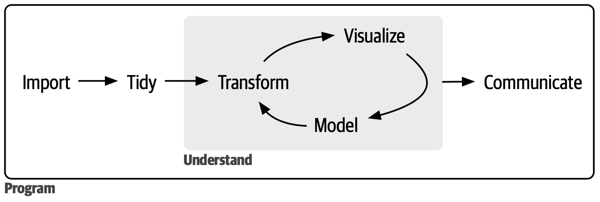

# Selamat Datang!

```{r}
#| echo: false
#| warning: false
#| message: false
library(tidyverse)
```

## Pendahuluan

-   Tentang workshop ini:

    -   Format live-coding; silakan ikuti bersama!

    -   Tujuan workshop: memberikan dasar-dasar yang cukup (setidaknya sampai ChatGPT tidak bisa membohongi Anda dengan mudah) dan kepercayaan diri untuk mengeksplorasi R secara mandiri.

    -   Jangan takut untuk bertanya! Kita semua di sini untuk belajar.

## Garis Besar Workshop

Workshop ini disusun mengikuti alur kerja berikut saat bekerja dengan data 

::: aside
Gambar diambil dari [R for Data Science (2e)](https://r4ds.hadley.nz/intro) oleh Hadley Wickham.
:::

## Garis Besar Seri Workshop

::: incremental
1.  **Impor** data ke R, yaitu mengambil data (dari file, API, dll.) dan memuatnya ke dalam dataframe di R
2.  **Rapikan (Tidy)** data yang sudah diimpor.
    -   Tidy = menyimpan dalam bentuk konsisten yang sesuai dengan semantik dataset.
    -   Tidy data = setiap kolom adalah variabel, setiap baris adalah observasi
3.  Setelah data rapi, kita dapat **mentransformasi**. Transformasi meliputi:
    -   mempersempit observasi yang diminati (seperti semua orang di satu kota atau semua data tahun lalu)
    -   membuat variabel baru dari variabel yang ada (seperti menghitung kecepatan dari jarak dan waktu)
    -   menghitung statistik ringkasan (seperti jumlah atau rata-rata).
4.  Setelah memiliki data rapi dengan informasi yang dibutuhkan, kita dapat **memvisualisasikan** dan **memodelkan**.
5.  **Mengkomunikasikan** hasilnya. Tidak peduli sebaik apa model dan visualisasi Anda memahami data, hasilnya perlu dikomunikasikan kepada orang lain.
:::

## Rencana Hari Ini

**Bagian 1: Dasar-Dasar R**

-   R dan RStudio, Objek, Nilai, dan Tipe data
-   Fungsi dan paket
-   Struktur data (vektor, faktor, dataframe)

**Bagian 2: Pengolahan Data dengan Tidyverse**

-   Import data CSV
-   Data wrangling: filter, select, mutate, group_by, summarize
-   Operator pipe (`|>`)

**Bagian 3: Visualisasi dan Statistik Deskriptif**

-   Statistik deskriptif univariat dan bivariat
-   Visualisasi dengan ggplot2
-   Faceting dan korelasi

## Apa itu R? Apa itu RStudio?

**R**: R adalah bahasa pemrograman open-source yang dikembangkan untuk analisis statistik dan visualisasi. Komunitas berbagi kode R dan membuat shortcut.

**RStudio:** Lingkungan perangkat lunak R yaitu RStudio adalah tempat kita berinteraksi lebih mudah dengan bahasa dan skrip R.

. . .

Anda perlu menginstal **keduanya** untuk workshop ini. Kunjungi <https://posit.co/download/rstudio-desktop> untuk mengunduh dan menginstal keduanya jika belum. Ingat: Instal R terlebih dahulu baru kemudian RStudio.

Lihat situs web workshop untuk panduan langkah demi langkah.

## Tur RStudio

Pertama, kita perlu familiar dengan antarmuka RStudio. Kita akan menggunakan RStudio untuk menulis kode, menavigasi file di komputer, memeriksa variabel yang kita buat, dan memvisualisasikan plot yang kita hasilkan.

{fig-align="center"}

## Sebelum Coding

-   Mengatur direktori kerja (working directory)
-   Membuat proyek
-   Membuat folder dan file

------------------------------------------------------------------------

### Mengatur Direktori Kerja (Working Directory)

-   Working directory -\> tempat R mencari file (skrip, data, dll.). Tetap terorganisir dengan semua file dan folder terkait proyek tersimpan di satu tempat.

    -   Secara default, akan berada di Desktop Anda.

    -   Praktik terbaik adalah menggunakan **R Project** untuk mengorganisir file dan data Anda.

    -   Saat menggunakan R Project, working directory = folder proyek.

### Membuat Proyek untuk Workshop Ini

1.  Buka `File` \> `New project`. Pilih `New directory`, lalu `New project`

2.  Masukkan `workshop-isei-regresi-sem` sebagai nama folder baru dan pilih lokasi penyimpanan, misalnya `Desktop` atau `Documents`. Ini akan menjadi working directory Anda selama workshop!

------------------------------------------------------------------------

### Membuat Folder di Dalam Direktori Kerja

-   `data` - kita akan menyimpan data mentah di sini. **Praktik terbaik adalah menjaga data di sini tidak diubah.**

-   `data-output` - jika perlu memodifikasi data mentah, simpan versi yang dimodifikasi di sini.

-   `fig-output` - kita akan menyimpan semua grafik yang dibuat di sini!

### Catatan

Jangan:

-   Jangan taruh proyek R di dalam folder OneDrive karena kadang menyebabkan masalah.

-   Nama folder/file harus menghindari spasi, simbol, dan karakter khusus. Gunakan huruf kecil semua.

Lakukan:

-   Jika working directory tidak sesuai, ubah di antarmuka RStudio dengan menavigasi ke lokasi yang benar di file browser, klik ikon gear biru "More", dan pilih "Set As Working Directory".

# Mari Mulai Coding!

Buat skrip R baru - `File` \> `New File` \> `R script`.

RStudio memungkinkan Anda mengeksekusi perintah langsung dari editor skrip dengan shortcut Ctrl + Enter (di Mac, Cmd + Return).

Anda bisa mengetik perintah langsung di konsol dan tekan Enter untuk mengeksekusi, tetapi perintah tersebut akan hilang saat sesi ditutup. Lebih baik mengetik perintah di editor skrip dan menyimpan skrip tersebut.

**Catatan: RStudio tidak menyimpan otomatis, jadi ingat untuk menyimpan secara berkala!**

## Objek dan Nilai di R

In this line of code:

```{r}
#| echo: true
country_name <- "Singapore"
```

-   `"Singapore"` adalah sebuah **nilai (value)**. Ini bisa berupa tipe data karakter, numerik, atau boolean. (lebih lanjut segera)
-   `country_name` adalah **objek** tempat kita menyimpan nilai ini. Ini agar kita bisa menyimpan nilai untuk digunakan nanti.
-   `<-` adalah operator penugasan (assignment) untuk menetapkan nilai ke objek.
    -   Anda juga bisa menggunakan `=`, tetapi umumnya di R, `<-` adalah konvensi.
    -   Shortcut keyboard: `Alt` + `-` di Windows (`Option` + `-` di Mac)

## Objek dan Nilai di R

In this line of code:

```{r}
#| echo: true
country_name <- "Singapore"
```

-   `"Singapore"` adalah sebuah **nilai (value)**. Ini bisa berupa tipe data karakter, numerik, atau boolean.

-   `country_name` adalah **objek** tempat kita menyimpan nilai ini.

-   `<-` adalah operator penugasan untuk menetapkan nilai ke objek.

    -   Anda juga bisa menggunakan `=`, tetapi umumnya di R, `<-` adalah konvensi.
    -   Shortcut keyboard: `Alt` + `-` di Windows (`Option` + `-` di Mac)

-   Aturan penamaan objek:

    -   Tidak boleh dimulai dengan angka

    -   Peka huruf besar/kecil (case sensitive)

    -   Tidak boleh ada spasi

    -   Beberapa kata dicadangkan (reserved words)

## Penyegaran: Tipe Data Kuantitatif

-   [**Data Non-Kontinu**]{.underline}

    -   **Nominal/Kategorikal**: Data non-urut, non-numerik, digunakan untuk merepresentasikan atribut kualitatif.

        -   Contoh: kebangsaan, kelurahan, status pekerjaan

    -   **Ordinal**: Data non-numerik berurutan.

        -   Contoh: Peringkat Nutri-grade, frekuensi olahraga (harian, mingguan, dua mingguan)

    -   **Diskrit**: Data numerik yang hanya bisa mengambil nilai tertentu (biasanya bilangan bulat)

        -   Contoh: Ukuran sepatu, ukuran pakaian

    -   **Biner**: Data nominal dengan hanya dua kemungkinan hasil

        -   Contoh: lulus/gagal, ya/tidak, selamat/tidak selamat

------------------------------------------------------------------------

-   [**Data Kontinu**]{.underline}

    -   **Interval**: Data numerik yang bisa mengambil nilai apa pun dalam rentang tertentu. [Tidak memiliki "nol sejati".]{.underline}

        -   Contoh: Skala Celsius. Suhu 0°C tidak berarti tidak ada panas.

    -   **Rasio**: Data numerik yang bisa mengambil nilai apa pun dalam rentang tertentu. [Memiliki "nol sejati".]{.underline}

        -   Contoh: Pendapatan tahunan. Pendapatan 0 berarti tidak ada pendapatan.

## Tipe Data di R

Empat tipe data dasar adalah **karakter (characters)**, **numerik (numeric)**, **boolean**, dan integer. Mari lihat contohnya:

```{r}
#| echo: true
#| code-line-numbers: "|1|2|3|4"

country_code <- "SGP" # Karakter
life_satisfaction <- 8.5 # Numerik (juga kadang disebut Double)
is_religious <- TRUE # Boolean/Logical (TRUE/FALSE). peka huruf besar/kecil
birth_year <- 1990L # Integer (bilangan bulat)
```

-   Untuk menyertakan komentar dalam kode, gunakan karakter \#.

-   Apa pun di sebelah kanan tanda \# sampai akhir baris dianggap sebagai komentar dan diabaikan oleh R saat eksekusi.

-   Praktik yang baik untuk membuat catatan dan menjelaskan kode.

## Memeriksa Tipe Data Variabel

Anda bisa menggunakan `str` atau `typeof` untuk memeriksa tipe data objek R.

```{r}
#| echo: true
typeof(country_code)
```

```{r}
#| echo: true
str(is_religious) 
```

**`str` mengembalikan tipe data dan nilainya.**

## Operasi Aritmatika di R

Anda bisa melakukan operasi aritmatika di R. Misalnya, mari hitung rata-rata skor kepuasan:

```{r}
#| echo: true
(8 + 7 + 9) / 3  # Rata-rata dari tiga skor kepuasan
```

```{r}
#| echo: true
2025 - 1990  # Hitung usia dari tahun lahir
```

## Operasi Boolean di R - Pernyataan TRUE/FALSE Sederhana

Operasi boolean di R berguna untuk memfilter data survei. Sebelum itu, mari lihat bagaimana R mengevaluasi pernyataan TRUE/FALSE sederhana

Apakah life_satisfaction lebih besar dari 8?

```{r}
#| echo: true

life_satisfaction <- 8.5 # tetapkan nilai 8.5 ke life_satisfaction
life_satisfaction > 8  
```

Apakah negara tersebut Singapura?

```{r}
#| echo: true

country_code == "SGP"  
```

Apakah negara tersebut BUKAN Singapura?

```{r}
#| echo: true

country_code != "SGP"  
```

## Operasi Boolean di R - Operator AND

Kadang kita memiliki beberapa pernyataan untuk dievaluasi. Di sinilah Operator Boolean berguna.

Operasi **AND** (kedua kondisi harus TRUE). Di R, direpresentasikan dengan ampersand `&`

Apakah negara Selandia Baru DAN apakah kepuasan hidup lebih dari 8?

```{r}
#| echo: true

(country_code == "NZL") & (life_satisfaction > 8) 
```

`country_code == "NZL"` adalah FALSE sementara `life_satisfaction > 8` adalah TRUE

Seluruh pernyataan akan mengembalikan FALSE karena tidak semua kondisi TRUE.

## Operasi Boolean di R - Operator OR

Operasi **OR** (setidaknya satu kondisi harus TRUE). Di R, direpresentasikan dengan simbol pipe `|`

Apakah negara Selandia Baru ATAU apakah kepuasan hidup lebih dari 8?

```{r}
#| echo: true

(country_code == "NZL") | (life_satisfaction > 8) 
```

Selama satu kondisi terpenuhi, ini akan TRUE.

## Fungsi di R

-   Fungsi seperti resep dalam memasak.

-   Fungsi mengambil bahan (input) dan menggunakan instruksi untuk menghasilkan hasil (output).

-   Di R, fungsi adalah kumpulan instruksi tertulis yang melakukan tugas tertentu. Nama fungsi selalu diikuti tanda kurung bulat `()`

Contoh: fungsi `round()` di R akan membulatkan angka.

```{r}
#| echo: true
round(3.1415926)
```

-   `round()` adalah "resep", sedangkan `3.1415926` adalah "bahan"

Menyimpan hasil ke objek:

```{r}
#| echo: true
rounded_pi <- round(3.1415926)
print(rounded_pi)
```

## Fungsi dengan Argumen di R

-   Mengikuti analogi resep, argumen adalah bahan yang Anda berikan ke fungsi. nama_fungsi(argumen/parameter)

-   Beberapa argumen wajib, yang lain opsional (memiliki nilai default).

-   Setiap argumen memberi tahu fungsi apa yang harus digunakan atau bagaimana melakukan tugas.

-   Contoh: Bayangkan pesanan bubble tea sebagai fungsi. Argumen/bahan yang mungkin:

    -   Teh - bahan wajib

    -   Susu - opsional, default-nya disertakan

    -   Topping - opsional, pilihan default "mutiara"

In R:

```{r}
#| echo: true
round(3.1415926, digits = 2)
```

-   `3.1415926` adalah argumen wajib (jika tidak diberikan, fungsi tidak akan berjalan)

-   `digits` adalah argumen opsional yang menentukan berapa desimal yang dibulatkan (default-nya 0)

## Bagaimana Mengetahui Lebih Lanjut Tentang Fungsi?

Anda bisa memanggil halaman bantuan / vignette di R dengan menambahkan `?` di depan nama fungsi.

Misalnya, jika ingin mengetahui lebih lanjut tentang fungsi `round`, jalankan `?round` di konsol R (panel kiri bawah)


## Struktur Data di R

Kita akan mulai dengan mengeksplorasi 3 tipe dasar **struktur** data di R:

1.  **Vektor** - dapat menampung beberapa nilai dalam satu variabel/objek.

2.  **Faktor** - Struktur data khusus di R untuk menangani variabel kategorikal.

3.  **Data frame** - Struktur data standar untuk data tabular di R, dan yang kita gunakan untuk pemrosesan, plotting, dan statistik.

Tipe lain (tidak dibahas dalam workshop ini):

-   Lists: Tipe vektor rekursif

-   Matrices: Kumpulan elemen dengan tipe sama dalam baris dan kolom


## Struktur Data di R - Visualisasi

{width=100% height=100%}

## Struktur Data di R: Vektor

Bayangkan vektor sebagai kolom dalam dataset. Ini adalah struktur data paling umum dan dasar di R. (semacam "pekerja keras" R!)

-   Vektor hanya bisa berisi 1 tipe data.

-   **Vektor dapat dibuat dengan fungsi c()**.

-   Dapat menambah, menghapus, atau mengubah nilai dalam vektor.

-   Periksa vektor: typeof(), str(), length()

```{r}
#| echo: true
countries <- c("CAN", "NZL", "SGP", "CAN", "SGP")
satisfaction_scores <- c(8, 7, 9, 6, 8)
employment_status <- c("Full time", "Student", "Part time", "Retired", "Full time")
```

## Manipulasi Vektor: Mengambil dan Memperbarui Item

Mengambil negara pertama dalam vektor

```{r}
#| echo: true
countries[1]
```

Mengambil tiga skor kepuasan pertama

```{r}
#| echo: true
satisfaction_scores[1:3]
```

Mengambil skor kepuasan pertama dan ketiga

```{r}
#| echo: true
satisfaction_scores[c(1,3)]
```

Memperbarui skor kepuasan pertama

```{r}
#| echo: true

satisfaction_scores[1] <- 7
print(satisfaction_scores)
```

## Mengapa Tanda Kurung Siku dan Bukan Kurung Bulat?

Tanda kurung bulat `()` untuk menjalankan fungsi, seperti menggunakan alat: `mean()` atau `sum()`.

Tanda kurung siku `[]` untuk mengakses bagian tertentu dari data Anda, di mana kita memasukkan nomor indeks elemen yang diinginkan.

## Manipulasi Vektor: Mengambil Item Berdasarkan Kriteria

Mari temukan skor kepuasan tinggi (di atas 7)!

-   Kode di bawah akan membuat vektor boolean bernama `criteria` yang mencatat apakah setiap item di `satisfaction_scores` memenuhi kondisi kita.

-   Kondisinya adalah "nilai harus \> 7". Jika item 1 memenuhi kondisi, maka item 1 'ditandai' sebagai `TRUE`. Jika tidak, akan `FALSE`

```{r}
#| echo: true
# Buat vektor boolean untuk kondisi kita
criteria <- satisfaction_scores > 7
print(criteria)
```

-   Baris kode ini menerapkan vektor boolean `criteria` ke `satisfaction_scores`, dan hanya mengambil item yang memenuhi kondisi.

```{r}
#| echo: true
# Gunakan vektor boolean untuk memfilter skor kepuasan
satisfaction_scores[criteria]
```

## Manipulasi Vektor: Menangani Nilai NA

-   Nilai NA menunjukkan nilai null, atau ketiadaan nilai (0 masih merupakan nilai!)

-   Fungsi ringkasan seperti `mean` memerlukan argumen `na.rm` tentang bagaimana penanganannya.

Data survei sering mengandung nilai yang hilang (NA):

```{r}
#| echo: true
financial_satisfaction <- c(8, 7, NA, 6, 9, NA, 7)

# Secara default, mean() akan mengembalikan NA jika ada nilai NA
mean(financial_satisfaction)

# Hapus nilai NA sebelum menghitung mean dengan menyertakan na.rm = TRUE
mean(financial_satisfaction, na.rm = TRUE)
```

## Struktur Data di R: Dataframe

-   Struktur data standar untuk data tabular di R, dan yang kita gunakan untuk pemrosesan data, plotting, dan statistik.

-   Mirip dengan spreadsheet - kumpulan persegi panjang dari variabel (kolom) dan observasi (baris)!

-   Anda bisa membuatnya secara manual seperti ini: (meskipun lebih umum Anda menggunakan ini untuk memuat data dari sumber eksternal)

```{r}
#| echo: true
survey_data <- data.frame(
    country = c("SGP", "CAN", "NZL", "SGP", "CAN"),
    life_satisfaction = c(8, 7, 9, 6, 8),
    employment = c("Full time", "Student", "Part time", "Retired", "Full time")
)
print(survey_data)
```


## Mengunduh Dataset World Values Survey (WVS)

Untuk workshop ini, kita akan mencoba memuat dataset dari file ke dalam dataframe!

Buka situs web workshop dan kunjungi tab 'Dataset' untuk mengunduh file data dan informasi tentang data WVS ini

Unduh CSV ini dan simpan di folder `data` di proyek R Anda!

## Paket di R (untuk fungsionalitas tambahan)

-   Paket adalah kumpulan fungsi, dataset R, dll. Paket memperluas fungsionalitas R.

    -   (Analogi terdekat: seperti add-on browser)

-   Paket populer: `tidyverse`, `caret`, `shiny`, dll.

-   Instalasi (**cukup sekali saja**): `install.packages("nama paket")`

-   Memuat paket (*perlu dijalankan setiap restart RStudio*): `library(nama paket)` - mari coba muat `tidyverse` karena kita akan menggunakan ini untuk memuat CSV ke dataframe!

    -   Tidyverse adalah kumpulan paket terkenal yang memfasilitasi proyek data science. Termasuk paket untuk manipulasi data, visualisasi, impor, dan tidying.

## Memuat Dataset WVS

Mari muat dataset World Values Survey menggunakan fungsi read_csv.

Sebelum menggunakan read_csv, instal dan muat paket tidyverse. Instal paket hanya sekali dan perlu memuat paket di setiap sesi sebelum menggunakannya.

```{r}
#| echo: true
#| output: true
library(tidyverse)

wvs_data <- read_csv("data/wvs1.csv")  
head(wvs_data)
```

Pastikan file CSV tersimpan di folder data Anda! (Tidak ada auto save)

## Mengeksplorasi Dataset WVS

```{r}
#| echo: true
#| output: false
#| eval: false

dim(wvs_data) # <1>
names(wvs_data) # <2>
str(wvs_data) # <3>
summary(wvs_data) # <4> 
head(wvs_data, n=5) # <5>
tail(wvs_data, n=5) # <6>
```

1.  mengembalikan vektor jumlah baris dan kolom
2.  memeriksa kolom
3.  memeriksa struktur
4.  menampilkan statistik ringkasan seluruh dataframe
5.  melihat 5 baris pertama
6.  melihat 5 baris terakhir


## Manipulasi Dasar Dataframe: Mengambil Nilai

Beberapa fungsi dasar dataframe sebelum kita lanjut ke data wrangling:

```{r}
#| echo: true
#| output: false
#| eval: false

wvs_data["negara"] # <1>
wvs_data$negara # <2>
wvs_data[3]  # <3>
wvs_data[1, 4] # <4> 
wvs_data[3, ] # <5>
```

1.  mengambil kolom berdasarkan nama kolom (dikembalikan sebagai tibble/dataframe)
2.  cara lain mengambil kolom berdasarkan nama (dikembalikan sebagai vektor)
3.  mengambil kolom berdasarkan indeks
4.  mendapatkan sel di koordinat baris, kolom ini
5.  mendapatkan seluruh baris

## Struktur Data di R: Faktor

-   Struktur data khusus di R untuk menangani data kategorikal.

-   Terlihat (dan sering berperilaku) seperti vektor karakter tetapi sebenarnya diperlakukan sebagai vektor integer.

-   Hanya dapat berisi kumpulan nilai yang telah ditentukan, dikenal sebagai `levels`. R selalu mengurutkan levels secara alfabet

-   Dapat berurutan (ordinal) atau tidak berurutan (nominal).

-   Mungkin terlihat seperti vektor biasa pada pandangan pertama, jadi gunakan `str()` untuk memeriksa.

-   Aplikasi paling umum: saat kita ingin menentukan kolom di dataframe sebagai kolom kategori

## Mengonversi Kolom Dataframe ke Faktor - Tidak Berurutan

Dalam contoh kita, `country` seharusnya menjadi faktor! 

```{r}
#| echo: true 
#| output: true

str(wvs_data$negara)
```

Karena tidak ada urutan bawaan dalam nama negara, kategori kita akan tidak berurutan:

```{r}
#| echo: true 
#| output: true
wvs_data$negara <- factor(wvs_data$negara)

# periksa level kategori
levels(wvs_data$negara)
```

Jika kita periksa strukturnya, kolom `country` seharusnya menjadi faktor bukan karakter sekarang:
```{r}
#| echo: true 
#| output: true

str(wvs_data$negara)
```
## Mengonversi Kolom Dataframe ke Faktor - Berurutan

Sebagai contoh faktor berurutan, misalkan kita ingin mengurutkan `status_pekerjaan` dari yang paling tidak aktif ke paling aktif secara ekonomi.

```{r}
#| echo: true 
#| output: true
wvs_data$status_pekerjaan <- factor(wvs_data$status_pekerjaan,
                                levels = c("Tidak bekerja", "Pelajar/Mahasiswa", 
                                           "Ibu rumah tangga", "Pensiunan",
                                           "Paruh waktu", "Penuh waktu", 
                                           "Wiraswasta", "Lainnya"),
                                ordered = TRUE)

# periksa level kategori dan struktur
levels(wvs_data$status_pekerjaan)
str(wvs_data$status_pekerjaan)
```

## Trouble Shooting

Types of messages

-   Error: Fatal error in your code that prevented it from being run through successfully. Need to fix it for the code to run.

-   Warning: Non-fatal errors (don’t stop the code from running, but this is a potential problem that you should know about).

-   Message: Helpful information about the code you just ran(can usually ignore these messages)

## Trouble Shooting

Check. Did you...

-   Set your working directory?

-   Check for missing commas (,), parentheses ()?

-   Check your spelling?

    -   Spelling : Punctuation \<- mea**a**n(c(1, 2, 3, 4)) or print(Punctuati**o**on)

    -   Punctuation : sum(10?20) or Punctuation \<- sum(c(10, 20))**)**

    -   Capitalization : s**U**m(c(5, 10, 15))

    -   In text indicators : X **+** Y or **\#**taking notes or “name” vs name

## Rekap

-   R & RStudio: R adalah bahasa pemrograman untuk komputasi statistik dan grafis, sementara RStudio adalah lingkungan yang memudahkan menulis, menjalankan, dan mengelola kode R.

-   Working Directory: Folder di komputer di mana R membaca dan menyimpan file.

-   Tipe Data: Jenis nilai yang dapat disimpan objek, seperti numerik, karakter, dan Boolean.

-   Struktur Data: Struktur data mengorganisir dan menyimpan data di R, seperti vektor, faktor, dan data frame.

-   Fungsi: Kode yang dapat digunakan kembali yang melakukan tugas tertentu. Bisa memanggil fungsi dengan argumen.

-   Paket: Kumpulan fungsi dan data untuk melakukan tugas. Perlu menginstal dan memuat paket.

# Bagian 2: Pengolahan Data dengan Tidyverse

## Garis Besar

1.  Memuat data ke dalam lingkungan RStudio
2.  Data wrangling dengan `dplyr` dan `tidyr` (bagian dari paket `tidyverse`)

## Alat yang Akan Kita Gunakan: dplyr dan tidyr

-   Paket dari `tidyverse`. ([klik di sini untuk ke halaman utama tidyverse](https://www.tidyverse.org/))

-   Posit telah membuat cheatsheet:

    -   [dplyr cheatsheet](https://rstudio.github.io/cheatsheets/html/data-transformation.html) \| [versi pdf](https://rstudio.github.io/cheatsheets/data-transformation.pdf)

    -   [tidyr cheatsheet](https://rstudio.github.io/cheatsheets/html/tidyr.html) \| [versi pdf](https://rstudio.github.io/cheatsheets/tidyr.pdf)

-   Fungsi yang akan sering digunakan:

    -   `drop_na()` - menghapus baris dengan nilai kosong (null)
    -   `select()` - untuk memilih kolom dari dataframe
    -   `filter()` - untuk menyaring baris berdasarkan kriteria
    -   `mutate()` - untuk membuat kolom baru atau mengedit yang sudah ada
    -   `if_else()` dan `case_when()` - membuat/mengedit kolom berdasarkan beberapa kriteria
    -   `group_by()` dan `summarize()` - mengelompokkan data dan merangkum setiap kelompok

## Mengapa Menggunakan Tidyverse?

::: incremental
-   Kode terlihat lebih mirip bahasa Inggris sehingga lebih intuitif bagi pemula
-   Tidyverse mengikuti pola sintaks yang konsisten
-   Pesan error yang lebih jelas dan membantu
:::

. . .

```r
# Base R
subset_data <- data[data$usia > 18 & data$kepuasan_hidup > 5, c("negara", "usia")]

# Tidyverse  
subset_data <- data |> 
  filter(usia > 18, kepuasan_hidup > 5)  |> 
  select(negara, usia)
```

## Penyegaran: Memuat dari CSV ke Dataframe

```{r}
#| echo: true
#| message: false

library(tidyverse)

# Baca file CSV data WVS (sudah diterjemahkan ke Bahasa Indonesia)
wvs_data <- read_csv("data/wvs1.csv")
glimpse(wvs_data)
```

## Operator Pipe ( \|\> )

-   Operator pipe (\|\>) memungkinkan kita merangkai beberapa operasi tanpa membuat dataframe perantara.
-   Pintasan keyboard: `Ctrl`+`Shift`+`M` di Windows, `Cmd`+`Shift`+`M` di Mac

::: panel-tabset
### Tanpa operator pipe

```r
wvs_data <- drop_na(wvs_data)
wvs_sorted <- arrange(wvs_data, desc(usia))
write_csv(wvs_sorted, "data-output/wvs-clean.csv")
```

### Dengan operator pipe

```r
wvs_data |> 
    drop_na() |> 
    arrange(desc(usia)) |> 
    write_csv("data-output/wvs-clean.csv")
```
:::

## Skenario: Data Wrangling dengan Data WVS {.smaller}

**Skenario**: Kita adalah asisten peneliti yang menganalisis pola nilai dan kepuasan di berbagai negara.

Langkah-langkah:

::: incremental
1.  Hapus semua baris dengan nilai kosong (NA) menggunakan `drop_na()`
2.  Periksa duplikasi data dengan `distinct()`
3.  Pilih kolom yang relevan dengan `select()`
4.  Saring responden berusia 18+ dengan `filter()`
5.  Buat kelompok usia dengan `mutate()` dan `case_when()`
6.  Simpan hasil ke CSV baru
:::

## Langkah #1: Hapus Nilai Kosong

```{r}
#| echo: true
wvs_data <- wvs_data |> 
  drop_na()

dim(wvs_data)
```

## Langkah #2: Periksa Duplikasi

```{r}
#| echo: true
wvs_data <- wvs_data |> 
  distinct(id_responden, .keep_all = TRUE)
```

## Langkah #3: Pilih Kolom yang Relevan

```{r}
#| echo: true
wvs_data <- wvs_data |>
    select(id_responden, negara, jenis_kelamin, tahun_lahir, usia,
           kepuasan_hidup, pentingnya_pekerjaan, kepuasan_finansial,
           kebebasan_memilih, religiusitas, skala_politik,
           status_pernikahan, status_pekerjaan) 

glimpse(wvs_data)
```

## Langkah #4: Filter dan Urutkan

```{r}
#| echo: true
wvs_data <- wvs_data |> 
    filter(usia >= 18) |> 
    arrange(desc(usia))

head(wvs_data)
```

## Langkah #5: Buat Variabel Baru dengan mutate()

Buat kelompok usia untuk setiap generasi:

```{r}
#| echo: true
wvs_data <- wvs_data |>
    mutate(kelompok_usia = case_when(
        usia <= 28 ~ "18-28",
        usia <= 44 ~ "29-44",
        usia <= 60 ~ "45-60",
        TRUE ~ "61+"
    ))

wvs_data |>
    select(usia, kelompok_usia) |>
    head(4)
```

## Checkpoint: Menyimpan Hasil ke CSV

```{r}
#| echo: true
wvs_data |> write_csv("data-output/wvs_cleaned_v1.csv")
```

Periksa folder `data-output` untuk memastikan file CSV sudah dibuat!

## Konversi ke Factor

```{r}
#| echo: true
kolom_faktor <- c("negara", "jenis_kelamin", "status_pernikahan", "status_pekerjaan")

wvs_cleaned <- wvs_data |> 
    mutate(across(all_of(kolom_faktor), as_factor))

str(wvs_cleaned)
```

## Analisis Deskriptif: group_by + summarize

```{r}
#| echo: true
wvs_cleaned |> 
    summarize(
        rata_rata = mean(kepuasan_hidup),
        sd = sd(kepuasan_hidup),
        n = n(),
        .by = negara
    )
```

## Analisis Deskriptif: Grup Kepuasan

```{r}
#| echo: true
wvs_cleaned <- wvs_cleaned |> 
    mutate(
        grup_kepuasan = if_else(
            kepuasan_hidup > mean(kepuasan_hidup),
            "Di Atas Rata-rata",
            "Di Bawah Rata-rata"
        )
    )

table(wvs_cleaned$negara, wvs_cleaned$grup_kepuasan)
```

## Pivot: Reshape Data

```{r}
#| echo: true
wvs_cleaned |> 
    summarize(
        rata_kepuasan = mean(kepuasan_hidup),
        .by = c(negara, kelompok_usia)
    ) |> 
    pivot_wider(
        names_from = kelompok_usia,
        values_from = rata_kepuasan
    )
```

## Latihan Tidyverse {.smaller}

> Muat file `data/wvs2.csv`, gabungkan dengan `wvs_data` menggunakan `bind_rows()`. Saring hanya responden dari Indonesia, hitung rata-rata `kepuasan_hidup` per `jenis_kelamin`.

```{r}
#| echo: true
#| code-fold: true
#| code-summary: "Jawaban"
wvs2 <- read_csv("data/wvs2.csv")
wvs_gabungan <- bind_rows(wvs_data, wvs2)

wvs_gabungan |> 
    filter(negara == "Indonesia") |> 
    summarize(
        rata_kepuasan = mean(kepuasan_hidup, na.rm = TRUE),
        n = n(),
        .by = jenis_kelamin
    )
```

# Bagian 3: Visualisasi dan Statistik Deskriptif

```{r}
#| echo: false
#| warning: false
#| message: false
library(DescTools)
```

## Statistik Deskriptif: Ukuran Pemusatan

```{r}
#| echo: true
mean(wvs_cleaned$usia, na.rm = TRUE)
median(wvs_cleaned$usia, na.rm = TRUE)
DescTools::Mode(wvs_cleaned$usia, na.rm = TRUE)
```

## Statistik Deskriptif: Ukuran Penyebaran

```{r}
#| echo: true
var(wvs_cleaned$usia, na.rm = TRUE)
sd(wvs_cleaned$usia, na.rm = TRUE)
range(wvs_cleaned$usia, na.rm = TRUE)
IQR(wvs_cleaned$usia, na.rm = TRUE)
```

## Pengantar ggplot2

-   `ggplot2` adalah sistem visualisasi data berbasis "Grammar of Graphics"
-   Setiap plot terdiri dari **layers**: data, aesthetic mapping, geom, dsb.

```r
ggplot(data, aes(x = variabel_x, y = variabel_y)) +
  geom_tipe_plot()
```

. . .

Komponen utama:

::: incremental
-   `ggplot()`: inisialisasi plot dengan data
-   `aes()`: pemetaan variabel ke estetika visual (x, y, warna, dll.)
-   `geom_*()`: tipe geometri plot (titik, garis, bar, dll.)
-   `labs()`: label dan judul
:::

## Histogram: Distribusi Satu Variabel

```{r}
#| echo: true
#| output-location: slide
ggplot(wvs_cleaned, aes(x = usia)) +
  geom_histogram(binwidth = 5, fill = "steelblue", color = "white") +
  labs(title = "Distribusi Usia Responden",
       x = "Usia", y = "Frekuensi") +
  theme_minimal()
```

## Boxplot: Distribusi per Grup

```{r}
#| echo: true
#| output-location: slide
ggplot(wvs_cleaned, aes(x = negara, y = kepuasan_hidup, fill = negara)) +
  geom_boxplot() +
  labs(title = "Kepuasan Hidup per Negara",
       x = "Negara", y = "Kepuasan Hidup") +
  theme_minimal() +
  theme(legend.position = "none")
```

## Bar Chart: Frekuensi Kategori

```{r}
#| echo: true
#| output-location: slide
ggplot(wvs_cleaned, aes(x = negara, fill = negara)) +
  geom_bar() +
  labs(title = "Jumlah Responden per Negara",
       x = "Negara", y = "Jumlah") +
  theme_minimal() +
  theme(legend.position = "none")
```

## Pie Chart

```{r}
#| echo: true
#| output-location: slide
proporsi_negara <- wvs_cleaned |> 
  count(negara) |> 
  mutate(persen = n / sum(n) * 100)

ggplot(proporsi_negara, aes(x = "", y = persen, fill = negara)) +
  geom_col(width = 1) +
  coord_polar(theta = "y") +
  labs(title = "Proporsi Responden per Negara") +
  theme_void()
```

## Scatter Plot: Hubungan Dua Variabel

```{r}
#| echo: true
#| output-location: slide
ggplot(wvs_cleaned, aes(x = kepuasan_finansial, y = kepuasan_hidup)) +
  geom_jitter(alpha = 0.3, width = 0.3, height = 0.3) +
  labs(title = "Kepuasan Finansial vs Kepuasan Hidup",
       x = "Kepuasan Finansial", y = "Kepuasan Hidup") +
  theme_minimal()
```

## Scatter Plot + Regresi Line

```{r}
#| echo: true
#| output-location: slide
ggplot(wvs_cleaned, aes(x = kepuasan_finansial, y = kepuasan_hidup)) +
  geom_jitter(alpha = 0.2, width = 0.3, height = 0.3) +
  geom_smooth(method = "lm", color = "red") +
  labs(title = "Kepuasan Finansial vs Kepuasan Hidup (dengan garis regresi)",
       x = "Kepuasan Finansial", y = "Kepuasan Hidup") +
  theme_minimal()
```

## Latihan Visualisasi 1 {.smaller}

> Buat histogram `kepuasan_finansial` dengan `binwidth = 1`.

```{r}
#| echo: true
#| code-fold: true
#| code-summary: "Jawaban"
ggplot(wvs_cleaned, aes(x = kepuasan_finansial)) +
  geom_histogram(binwidth = 1, fill = "steelblue", color = "white") +
  labs(title = "Distribusi Kepuasan Finansial",
       x = "Kepuasan Finansial", y = "Frekuensi") +
  theme_minimal()
```

## Tabulasi Silang (Cross Tabulation)

```{r}
#| echo: true
table(wvs_cleaned$kelompok_usia, wvs_cleaned$negara)
```

. . .

```{r}
#| echo: true
wvs_cleaned |> 
  count(negara, kelompok_usia) |> 
  pivot_wider(names_from = negara, values_from = n)
```

## Stacked Bar Chart

```{r}
#| echo: true
#| output-location: slide
ggplot(wvs_cleaned, aes(x = negara, fill = kelompok_usia)) +
  geom_bar() +
  labs(title = "Distribusi Kelompok Usia per Negara",
       x = "Negara", y = "Jumlah", fill = "Kelompok Usia") +
  theme_minimal()
```

## Grouped Bar Chart

```{r}
#| echo: true
#| output-location: slide
ggplot(wvs_cleaned, aes(x = negara, fill = kelompok_usia)) +
  geom_bar(position = "dodge") +
  labs(title = "Distribusi Kelompok Usia per Negara (Grouped)",
       x = "Negara", y = "Jumlah", fill = "Kelompok Usia") +
  theme_minimal()
```

## Proportional Bar Chart

```{r}
#| echo: true
#| output-location: slide
ggplot(wvs_cleaned, aes(x = negara, fill = kelompok_usia)) +
  geom_bar(position = "fill") +
  labs(title = "Proporsi Kelompok Usia per Negara",
       x = "Negara", y = "Proporsi", fill = "Kelompok Usia") +
  theme_minimal() +
  scale_y_continuous(labels = scales::percent)
```

## Korelasi

```{r}
#| echo: true
cor(wvs_cleaned$kepuasan_finansial, wvs_cleaned$kepuasan_hidup)
```

## Faceting: Plot per Grup

```{r}
#| echo: true
#| output-location: slide
ggplot(wvs_cleaned, aes(x = kepuasan_finansial, y = kepuasan_hidup)) +
  geom_jitter(alpha = 0.2, width = 0.3, height = 0.3) +
  geom_smooth(method = "lm", color = "red") +
  facet_wrap(~ negara) +
  labs(title = "Kepuasan Finansial vs Kepuasan Hidup per Negara",
       x = "Kepuasan Finansial", y = "Kepuasan Hidup") +
  theme_minimal()
```

## Matriks Korelasi

```{r}
#| echo: true
#| output-location: slide
library(corrplot)

wvs_cleaned |> 
  select(kepuasan_hidup, kepuasan_finansial, religiusitas,
         kebebasan_memilih, usia) |> 
  cor(use = "complete.obs") |> 
  corrplot(method = "color", type = "upper",
           addCoef.col = "black", number.cex = 0.8,
           tl.col = "black", tl.cex = 0.8)
```

## Menyimpan Plot: ggsave()

```{r}
#| echo: true
#| eval: false
p <- ggplot(wvs_cleaned, aes(x = kepuasan_finansial, y = kepuasan_hidup)) +
  geom_jitter(alpha = 0.2) +
  geom_smooth(method = "lm") +
  theme_minimal()

ggsave("output/scatter_kepuasan.png", plot = p, width = 8, height = 6, dpi = 300)
```

## Latihan Visualisasi 2 {.smaller}

> Buat boxplot `kepuasan_finansial` per `jenis_kelamin`, dengan facet per `negara`.

```{r}
#| echo: true
#| code-fold: true
#| code-summary: "Jawaban"
ggplot(wvs_cleaned, aes(x = jenis_kelamin, y = kepuasan_finansial,
                        fill = jenis_kelamin)) +
  geom_boxplot() +
  facet_wrap(~ negara) +
  labs(title = "Kepuasan Finansial per Jenis Kelamin dan Negara",
       x = "Jenis Kelamin", y = "Kepuasan Finansial") +
  theme_minimal() +
  theme(legend.position = "none")
```

# Ringkasan Sesi 1

## Apa yang Sudah Kita Pelajari

::: incremental
-   **Dasar R**: objek, tipe data, vektor, faktor, dataframe
-   **Tidyverse**: `select()`, `filter()`, `mutate()`, `case_when()`, `group_by()`, `summarize()`, `pivot_wider()`
-   **Visualisasi**: histogram, boxplot, bar chart, pie chart, scatter plot, faceting, korelasi
:::

## Sesi Berikutnya

**Sesi 2: Analisis Regresi**

-   Regresi linear sederhana dan berganda
-   Diagnostik dan asumsi
-   Variabel kategorikal dan interaksi

# Akhir Sesi 1!

Terima kasih! Sampai jumpa di sesi berikutnya.
