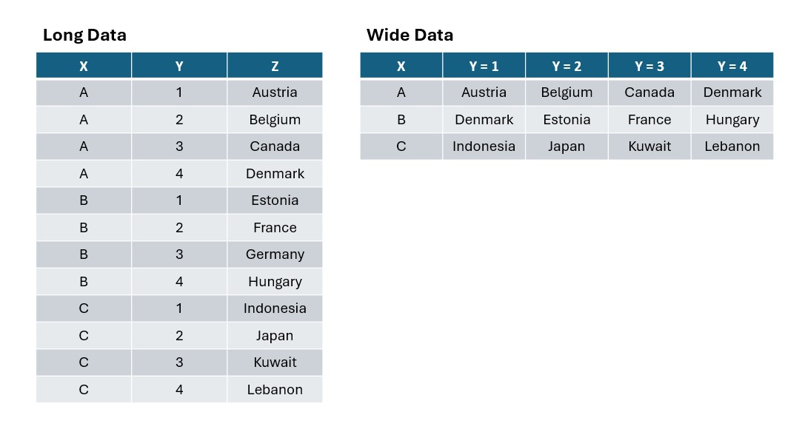
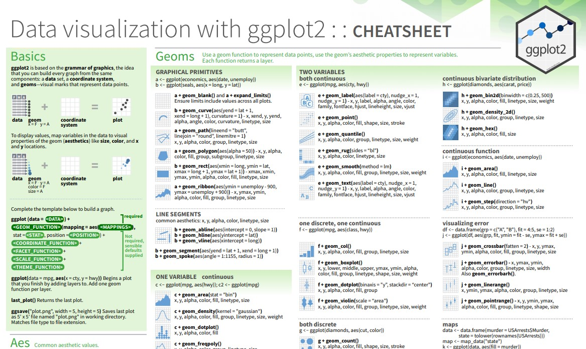

## Garis Besar Hari Ini

1.  Statistik deskriptif univariat dan visualisasi
    - untuk variabel kontinu
    - untuk variabel kategorikal (frekuensi atau proporsi)
2.  Statistik deskriptif bivariat (dua variabel) dan visualisasi
    - keduanya kategorikal
    - keduanya kontinu (+ plot korelasi)
    - satu kategorikal, satu kontinu
3.  Menggunakan Facet
4.  Praktik terbaik
5.  Rekap + Kuis!

## Checklist Saat Memulai RStudio

-   Buka proyek yang kita buat di sesi sebelumnya dan buka file R script.
-   Pastikan panel `Environment` kosong (klik ikon sapu untuk membersihkannya)
-   Bersihkan juga `Console` dan `Plots`.
-   Jalankan ulang bagian `library(tidyverse)` dan `read_csv` dari sesi sebelumnya

## Penyegaran: Memuat CSV ke dalam Dataframe

Gunakan `read_csv` dari paket `readr` (bagian dari `tidyverse`) untuk memuat data kita ke dalam dataframe

```{r}
#| echo: true
#| label: load-data
#| message: false
#| output: false

# impor library tidyverse
library(tidyverse)

# baca file CSV berisi data WVS
wvs_cleaned <- read_csv("data-output/wvs_cleaned_v1.csv")

# Konversi variabel kategorikal menjadi faktor
columns_to_convert <- c("country", "religiousity", "sex", "marital_status", "employment")

wvs_cleaned <- wvs_cleaned |> 
    mutate(across(all_of(columns_to_convert), as_factor))

# lihat sekilas datanya, perhatikan tipe datanya!
glimpse(wvs_cleaned)
```

## Penyegaran: Statistik Deskriptif

::: incremental
-   Statistik Deskriptif Univariat (satu variabel)

    -   Ukuran tendensi sentral: `mean()`, `median()`, `Mode()`
    -   Ukuran Variabilitas: `min()`, `max()`, `range()`, `IQR()`, `sd()` (standar deviasi), `var()` (varians)
    -   Bentuk distribusi: `skewness()` dan `kurtosis()` dari library `moments`. Lebih mudah dilihat dengan histogram

-   Statistik Deskriptif Bivariat (dua variabel)

    -   Tabel kontingensi / tabulasi silang (untuk data kategorikal)
    -   Kovarians - menggambarkan bagaimana dua variabel bervariasi bersama
    -   Korelasi - menggambarkan kekuatan dan arah hubungan **dalam sebuah sampel**. (Jika kita ingin menggunakannya untuk menyimpulkan tentang populasi dari sampel, itu termasuk statistik inferensial)
    -   Visualisasi misalnya Scatterplot, boxplot berdampingan, stacked bar chart, dll.
:::

## Penyegaran: Fungsi Dasar R untuk Statistik Deskriptif

Minggu lalu, kita telah mempelajari beberapa fungsi dasar R untuk statistik deskriptif.

-   `mean()`: rata-rata aritmetika
-   `median()`: nilai tengah
-   `sd()`: standar deviasi
-   `var()`: varians
-   `range()`: rentang nilai
-   `IQR()`: rentang interkuartil
-   `summary()`: menyediakan ringkasan statistik deskriptif
-   Fungsi `Mode()` dari paket `DescTools`: nilai yang paling sering muncul [^1]

[^1]: R tidak memiliki fungsi bawaan untuk modus, sehingga kita memerlukan paket `DescTools` untuk mendapatkan fungsi ini


## Penyegaran: Data Panjang vs Lebar

::::: columns
::: {.column width="50%"}
**Data panjang:**

-   Setiap baris adalah satu observasi unik.

-   Ada kolom terpisah yang menunjukkan variabel atau jenis pengukuran

-   Format ini lebih "mudah dipahami" oleh R, lebih cocok untuk visualisasi (yang akan kita pelajari lebih lanjut minggu depan!)
:::

::: {.column width="50%"}
**Data lebar:**

-   Setiap baris adalah nilai dalam variabel.

-   Setiap kolom adalah nilai dalam variabel --\> semakin banyak nilai yang dimiliki, semakin "lebar" datanya

-   Format ini lebih intuitif bagi manusia!
:::
:::::

## Data Panjang vs Lebar: Contoh

::::: columns
::: {.column width="50%"}
**Long data:**

```{r}
#| echo: false

library(kableExtra)

# Creating the wide data frame
long_data <- wvs_cleaned |>
    group_by(country, age_group) |>
    summarise(count = n()) 

long_data |> 
    kbl(caption = "Observations (Long)")  |> 
    kable_styling(bootstrap_options = c("striped", "bordered"), font_size = "85%")

```
:::

::: {.column width="50%"}
**Wide data:**

```{r}
#| echo: false

long_data |>
    pivot_wider(names_from = "age_group", values_from = "count") |> 
    kbl(caption = "Observations (Wide)") |> 
    kable_styling(bootstrap_options = c("striped", "bordered"), font_size = "85%")
```
:::
:::::

## Data Panjang vs Lebar: Cara Mengenali

Perhatikan kolom-kolom pada data. 



# Statistik Deskriptif Univariat + Visualisasi

## Ukuran Tendensi Sentral

Mari kita mulai dengan memeriksa variabel `age` dalam dataset kita.

```{r}
#| echo: true

library(DescTools)
# jika muncul error, instal library terlebih dahulu dengan kode ini:
# install.packages("DescTools")

# Statistik dasar
mean_age <- mean(wvs_cleaned$age, na.rm = TRUE)
median_age <- median(wvs_cleaned$age, na.rm = TRUE)
mode_age <- DescTools::Mode(wvs_cleaned$age, na.rm = TRUE)

# Cetak hasil
cat("Mean age:", mean_age, "\n") # cat adalah singkatan dari concatenate
cat("Median age:", median_age, "\n")
cat("Most frequently occuring age:", mode_age, "\n") # ini hanya untuk tujuan demonstrasi

```

------------------------------------------------------------------------

Cara kita menginterpretasikan / melaporkan ini:

*"Distribusi usia dari sampel ini cukup simetris, ditunjukkan oleh nilai mean (48 tahun) dan median (48 tahun) yang sangat berdekatan. Modus 54 tahun menunjukkan sedikit kemiringan ke kanan (right-skew) dalam distribusi usia, dengan konsentrasi partisipan di usia pertengahan 50-an."*

## Ukuran Variabilitas atau Dispersi

```{r}
#| echo: true


var_age <- var(wvs_cleaned$age, na.rm = TRUE)
sd_age <- sd(wvs_cleaned$age, na.rm = TRUE)
range_age <- range(wvs_cleaned$age, na.rm = TRUE)
iqr_age <- IQR(wvs_cleaned$age, na.rm = TRUE)

cat("Variance of age:", var_age, "\n")
cat("Standard deviation of age:", sd_age, "\n")
cat("Range of age:", range_age[1], "to", range_age[2], "\n")
cat("Interquartile range of age:", iqr_age, "\n")

```

------------------------------------------------------------------------

Cara kita menginterpretasikan / melaporkan ini:

*"Distribusi usia dari sampel ini cukup tersebar luas. Dengan standar deviasi 16,72144, menunjukkan bahwa usia sebagian besar individu menyimpang dari rata-rata sekitar 16,72 tahun. Rentang usia membentang dari 18 hingga 93 tahun, yang mencakup berbagai kelompok usia dalam sampel. Rentang interkuartil (IQR) sebesar 28 tahun, yang mewakili 50% data tengah, menunjukkan distribusi usia yang cukup luas di bagian tengah dataset."*

## Bentuk Distribusi

Fungsi `skewness()` dan `kurtosis()` tersedia melalui paket R bernama `moments`. Anda mungkin perlu menginstalnya terlebih dahulu sebelum memanggil library dan fungsi-fungsinya seperti pada kode di bawah ini.

```{r}
#| echo: true


library(moments)
# jika muncul error, instal library terlebih dahulu dengan kode ini:
# install.packages("moments")

skew_age <- skewness(wvs_cleaned$age, na.rm = TRUE)
kurtosis_age <- kurtosis(wvs_cleaned$age, na.rm = TRUE)

cat("Skewness of age:", skew_age, "\n")
cat("Kurtosis of age:", kurtosis_age, "\n")

```

------------------------------------------------------------------------

Cara kita menginterpretasikan / melaporkan ini:

*"Distribusi usia memiliki kemiringan ke kanan yang sangat sedikit (skewness = 0,10), artinya terdapat sedikit lebih banyak outlier ke arah usia yang lebih tua, tetapi kemiringannya minimal karena nilai antara -0,5 dan 0,5 dianggap kira-kira simetris. Kurtosis sebesar 2,02 lebih rendah dari kurtosis distribusi normal yaitu 3, menunjukkan distribusi ini bersifat platikurtik - memiliki ekor yang lebih ringan dan lebih seragam atau 'lebih datar' dibandingkan distribusi normal."*

## Visualisasi dengan ggplot - Histogram

-   Mendeskripsikan sebaran dan bentuk distribusi hanya dengan kata-kata tidaklah produktif, sehingga biasanya disertai dengan visualisasi.

-   `ggplot` adalah paket visualisasi yang termasuk dalam paket `tidyverse`

-   Bekerja paling baik dengan data dalam format panjang (long format), yaitu satu kolom untuk semua dimensi/ukuran dan kolom lain untuk nilai setiap dimensi/ukuran.

```{r}
#| echo: true
#| output-location: slide

wvs_cleaned |> 
    ggplot(aes(x = age)) +
    geom_histogram(binwidth = 1, fill = "lightblue", color = "navy") +
    labs(title = "Age distribution of respondents",
         x = "Age",
         y = "Count") +
    theme_minimal()
```

## Anatomi Kode ggplot

Grafik yang dibuat dengan ggplot harus mencakup hal-hal berikut:

``` {.r code-line-numbers="|1|2|3|4-6|7"}
wvs_cleaned |> # <1>
    ggplot(aes(x = age)) + # <2>
    geom_histogram(binwidth = 1, fill = "lightblue", color = "navy") + # <3>
    labs(title = "Age distribution of respondents", # <4>
         x = "Age", # <4>
         y = "Count") + # <4>
    theme_minimal() # <5>
```

1.  **Data** - dataframe/tibble yang akan divisualisasikan.

2.  **Aesthetic mappings (aes)** - menentukan variabel mana yang dipetakan ke sumbu x, y, alpha (transparansi) dan estetika visual lainnya.

3.  **Geometric objects (geom)** - menentukan bagaimana nilai ditampilkan; sebagai batang, scatterplot, garis, dll.

4.  Berikan judul dan label pada grafik Anda

5.  (Opsional) terapkan tema/tampilan pada grafik Anda

## Tips: Buka Cheatsheet ggplot

::: callout-tip
**Strategi yang saya rekomendasikan:** baca sekilas dokumentasi `ggplot2` dan buka di tab terpisah. Tentukan jenis variabel yang perlu Anda visualisasikan (diskrit atau kontinu) untuk mengidentifikasi dengan cepat visualisasi mana yang masuk akal.
:::

{width="60%"}

[ggplot documentation link](https://rstudio.github.io/cheatsheets/html/data-visualization.html)

## Data Kontinu - Boxplot

Mari kita visualisasikan variabilitas dengan boxplot untuk mendapatkan gambaran sebaran yang lebih baik.

```{r}
#| echo: true
#| output-location: slide

wvs_cleaned |> 
    ggplot(aes(x = age)) +
    geom_boxplot(fill = "lightblue", color = "navy") +
    labs(title = "Age distribution of respondents",
         x = "Age") +
    theme_minimal()


```

## Data Kategorikal - Bar Chart untuk Distribusi Frekuensi

-   Variabel `age` adalah data numerik / kontinu. Kita tidak bisa menerapkan `mean()`, `median()` dan ukuran tendensi sentral lainnya pada data kategorikal seperti `age_group` atau `employment_status`. Namun, kita bisa memvisualisasikannya.

-   Saat berhadapan dengan data kategorikal, pertama-tama perhatikan apakah Anda ingin memvisualisasikan **proporsi** atau **distribusi frekuensi**. 

-   Mari kita visualisasikan distribusi frekuensi peserta survei berdasarkan `country`:

```{r}
#| echo: true
#| output-location: slide

wvs_cleaned |> ggplot(aes(x = country, fill = country)) +
    geom_bar() +
    labs(title = "Participants by Country",
       x = "Country",
       y = "Participants") +
    theme_minimal()

```

## Data Kategorikal - Pie Chart untuk Proporsi

Ketika kita ingin menunjukkan proporsi (yaitu dalam hal "bagian dari keseluruhan"), kita harus terlebih dahulu menghitung proporsi dengan `count()`

Mari kita buat dataframe baru bernama `wvs_country_proportion` untuk menyimpan data ini.

```{r}
#| echo: true

wvs_country_proportion <- wvs_cleaned |> 
    group_by(country) |>
    summarize(n = n()) |> # hitung jumlah partisipan setiap negara
    mutate(proportion = n/sum(n)) # hitung proporsi

print(wvs_country_proportion)

```


## Data Kategorikal - Pie Chart untuk Proporsi

Kemudian, kita gunakan tabel proporsi ini untuk membuat pie chart dengan menambahkan layer `coord_polar()` setelah `geom_bar()` dan beberapa perubahan pada `aes()` dan `geom_bar()`

```{r}
#| echo: true
#| output-location: slide

wvs_country_proportion |> ggplot(aes(x = "", y = proportion, fill = country)) +
    geom_bar(stat = "identity", width = 1) +
    coord_polar("y", start = 0) +
    labs(title = "Proportion of Participants by Country") +
    theme_minimal()

```

::: aside
Note: if you have lots of categories, pie chart is not always the best option. The code for this pie chart is from [R Graph Gallery](https://r-graph-gallery.com/piechart-ggplot2.html)
:::

## Latihan Cek - Grammar of Graphics

Menggunakan dataset `wvs_cleaned`:

Buat histogram yang memvisualisasikan distribusi `financial_satisfaction`

```{r}
#| echo: true
#| output-location: slide
#| code-fold: true
#| code-summary: "Show answer"

wvs_cleaned |> ggplot(aes(x = financial_satisfaction)) +
  geom_histogram(fill = "steelblue", color = "white", binwidth = 1) +
  labs(title = "Distribution of Financial Satisfaction",
       x = "Financial Satisfaction",
       y = "Count") +
  theme_minimal()

```


# Statistik Deskriptif Bivariat + Visualisasi

## Tiga Kombinasi dalam Statistik Deskriptif Bivariat

Statistik deskriptif bivariat mendeskripsikan dan merangkum hubungan antara dua variabel dalam dataset Anda **tanpa membuat inferensi tentang populasi yang lebih besar**. Termasuk di dalamnya ukuran numerik seperti korelasi atau kovarians, dan visualisasi seperti scatterplot, boxplot berdampingan, atau tabel kontingensi.

Bayangkan sebagai potret bagaimana dua variabel saling berhubungan dalam data Anda saat ini.

Karena data bisa kontinu atau kategorikal, ada tiga kombinasi saat kita berurusan dengan statistik deskriptif bivariat:

1.  Keduanya kategorikal (misalnya `age_group` dan `country`)
2.  Keduanya kontinu (misalnya `financial_satisfaction` dan `life_satisfaction`)
3.  Satu kontinu, satu kategorikal (misalnya `country` dan `life_satisfaction`)

## Keduanya Kategorikal

-   Memeriksa hubungan antara variabel kategorikal

-   Melihat distribusi gabungan dan proporsi

-   Membandingkan komposisi kelompok

Pertama, mari kita buat tabel kontingensi dari `age_group` dan `country`!

```{r}
#| echo: true

table(wvs_cleaned$age_group, wvs_cleaned$country)

```

## Keduanya Kategorikal - Tabel Proporsi
Kita juga bisa membuat tabel proporsi seperti yang kita lakukan sebelumnya

```{r}
#| echo: true

wvs_cleaned |> 
  group_by(country, age_group) |> 
  summarise(n = n()) |> # hitung frekuensi partisipan berdasarkan kelompok usia dan negara 
  mutate(prop = n/sum(n)) # hitung proporsi

```

## Keduanya Kategorikal - Bar Chart

Untuk data kategorikal seperti ini, kita bisa menggunakan barchart untuk memvisualisasikan distribusi frekuensi. Stacked bar chart dapat digunakan untuk memvisualisasikan proporsi.

```{r}
#| echo: true
#| output-location: slide

wvs_cleaned |> ggplot(aes(x = country, fill = age_group)) +
  geom_bar(position = "dodge") + 
  labs(y = "Count", title = "Age Groups by Country") +
  theme_minimal()

```
## Keduanya Kategorikal - Stacked Bar Chart

Ubah `position = "dodge"` menjadi `position = "stack"` untuk menumpuk bar chart

```{r}
#| echo: true
#| output-location: slide

wvs_cleaned |> ggplot(aes(x = country, fill = age_group)) +
  geom_bar(position = "stack") + 
  labs(y = "Count", title = "Age Groups by Country") +
  theme_minimal()

```


## Keduanya Kategorikal - Percent-stacked Bar Chart

Untuk mendapatkan gambaran proporsi yang lebih baik untuk setiap negara, kita bisa menggunakan percent stacked bar chart.

Kodenya mirip dengan bar chart sebelumnya; kita hanya perlu mengubah argumen `position` menjadi `position = "fill"`

```{r}
#| echo: true
#| output-location: slide

wvs_cleaned |> ggplot(aes(x = country, fill = age_group)) +
  geom_bar(position = "fill") + 
  labs(y = "Proportion", title = "Age Groups by Country") +
  theme_minimal()

```

## Keduanya Kontinu

-   Memeriksa hubungan linear

-   Mencari pola dan tren

-   Mengidentifikasi potensi outlier

Mari kita periksa terlebih dahulu korelasi antara `financial_satisfaction` dan `life_satisfaction`

```{r}
#| echo: true

cor(wvs_cleaned$financial_satisfaction, wvs_cleaned$life_satisfaction)

```
## Keduanya Kontinu - Jitter / Scatterplot

Mari kita visualisasikan kedua variabel bersama-sama dengan jitter / scatterplot!

```{r}
#| echo: true
#| output-location: slide

wvs_cleaned |> ggplot(aes(x = financial_satisfaction, y = life_satisfaction)) +
  geom_jitter(alpha = 0.3) +
  geom_smooth(method = "lm") + # layer with geom_smooth
  labs(title = "Financial vs Life Satisfaction") +
  theme_minimal()

```


## Satu Kontinu, Satu Kategorikal - Tabel Ringkasan

-   Membandingkan distribusi antar kelompok

-   Mengidentifikasi perbedaan antar kelompok

-   Memeriksa sebaran dalam kelompok

Mari kita lakukan rekap dari minggu lalu dan dapatkan statistik ringkasan untuk `life_satisfaction` dari setiap `country`

```{r}
#| echo: true

wvs_cleaned |> 
  group_by(country) |> 
  summarise(
    mean_satisfaction = mean(life_satisfaction, na.rm = TRUE),
    median_satisfaction = median(life_satisfaction, na.rm = TRUE),
    sd_satisfaction = sd(life_satisfaction, na.rm = TRUE)
  )

```

## Satu Kontinu, Satu Kategorikal - Boxplot

Untuk mendapatkan gambaran yang lebih baik tentang variasi dan sebaran data, mari kita visualisasikan dengan boxplot berdampingan

```{r}
#| echo: true
#| output-location: slide

wvs_cleaned |> ggplot(aes(x = country, y = life_satisfaction)) +
  geom_boxplot() +
  labs(title = "Life Satisfaction by Country") +
  theme_minimal()

```

## Satu Kontinu, Satu Kategorikal (lanjutan) - Boxplot dan Violin Plot Berlapis

Kita juga bisa melapisi boxplot dengan violin plot untuk mendapatkan gambaran distribusi setiap kelompok yang lebih baik. 

```{r}
#| echo: true
#| output-location: slide

wvs_cleaned |> ggplot(aes(x = country, y = life_satisfaction)) +
  geom_violin(fill = "lightblue", alpha = 0.5) +
  geom_boxplot(width = 0.1, fill = "white") +
  labs(title = "Life Satisfaction Distribution by Country") +
  theme_minimal()

```

## Cara Menyimpan Gambar - ggsave

Ada dua cara untuk melakukan ini:

1.  Melalui `ggsave`

2.  Cara klik manual di RStudio

Berikut adalah cara `ggsave`:

```r
# simpan grafik ke dalam objek alih-alih langsung menampilkannya seperti yang kita lakukan selama ini
boxplot_obj <- wvs_cleaned |> 
    ggplot(aes(x = age)) +
    geom_boxplot(fill = "lightblue", color = "navy") +
    labs(title = "Age distribution of respondents",
         x = "Age") +
    theme_minimal()

# masukkan grafik yang tersimpan ke ggsave dan beri nama file
ggsave("fig-output/boxplot_1.jpg", boxplot_obj) 

```

## Cara Menyimpan Gambar - Klik Manual

1.  Buka tab `plots` di panel kanan
2.  Klik tombol `Export`. Anda bisa mengekspor plot sebagai file gambar, atau sebagai PDF. 
3.  Penting: agar file Anda tetap terorganisir, simpan gambar yang diekspor ke folder `fig-output` yang telah Anda buat di Sesi 1. 


## Menggunakan Facet untuk Visualisasi Lebih Kompleks

-   Membandingkan pola di berbagai subkelompok

-   Mengidentifikasi efek interaksi

-   Menjaga kejelasan visual dengan hubungan yang kompleks

Facet grid berguna ketika kita memiliki lebih dari dua variabel untuk divisualisasikan. Namun, jika digunakan secara berlebihan bisa menjadi terlalu kompleks

```{r}
#| echo: true
#| output-location: slide

wvs_cleaned |> ggplot(aes(x = financial_satisfaction, y = life_satisfaction)) +
  geom_point(alpha = 0.3) +
  geom_smooth(method = "lm") +
  facet_grid(country ~ religiousity)

```

## Apakah Lebih Rumit = Lebih Baik?

Visualisasi yang lebih rumit dan kompleks tidak selalu berarti lebih baik!

Lihatlah visualisasi pemenang penghargaan oleh [Simon Scarr](http://www.simonscarr.com/iraqs-bloody-toll)


# Akhir Sesi 3!

Ingat strateginya:

1.  Buka dokumentasi/cheatsheet ggplot
2.  Tentukan berapa banyak variabel yang terlibat. Apakah hanya satu? dua? lebih dari dua?
3.  Tentukan apakah variabel tersebut kategorikal atau kontinu. Jika Anda memiliki lebih dari satu, apakah keduanya kategorikal? satu kategorikal + satu kontinu?
4.  Lihat dokumentasi untuk menentukan jenis visualisasi mana yang cocok untuk variabel Anda.

Kunjungi [R Graph gallery](https://r-graph-gallery.com/) untuk inspirasi dan contoh kode!

Sesi berikutnya: statistik inferensial di R menggunakan data WVS

# Lampiran

## Latihan di Rumah #1

Buat barchart yang memvisualisasikan frekuensi `religiousity`

```{r}
#| echo: true
#| output-location: slide
#| code-fold: true
#| code-summary: "Show answer"

wvs_cleaned |> ggplot(aes(x = religiousity, fill = religiousity)) +
  geom_bar() +
  labs(title = "Frequency of Religiosity",
       x = "Religiosity",
       y = "Count") +
  theme_minimal()

```

## Latihan di Rumah #2

Buat boxplot berdampingan yang memvisualisasikan `political_scale` untuk setiap `sex`.

```{r}
#| echo: true
#| output-location: slide
#| code-fold: true
#| code-summary: "Show answer"

wvs_cleaned |> ggplot(aes(x = political_scale, y = sex)) +
  geom_violin(fill = "lightblue", alpha = 0.5) +
  geom_boxplot(width = 0.1, fill = "white") +
  labs(title = "Political scale Distribution by Sex") +
  theme_minimal()

```

## Plot Korelasi

Ketika ada lebih dari dua variabel kontinu yang ingin dieksplorasi, peta korelasi terkadang digunakan. Kita bisa melakukannya dengan ggplot, tetapi jauh lebih mudah menggunakan fungsi `corrplot()` dari paket `corrplot`.

Mari kita visualisasikan peta korelasi untuk ketiga variabel ini.

```{R}
#| echo: true
#| output-location: slide

library(corrplot)

# pilih semua kolom untuk perhitungan korelasi, simpan ke columns_for_corr
columns_for_corr <- wvs_cleaned |> 
  select(financial_satisfaction, life_satisfaction, age)

# masukkan columns_for_corr ke fungsi cor(), dan simpan hasilnya ke cor_matrix
cor_matrix <- cor(columns_for_corr)

# visualisasikan cor_matrix dengan corrplot()!
corrplot(cor_matrix,
         method = "shade", # tampilkan kekuatan korelasi sebagai gradasi warna
         addCoef.col = "black", tl.col = "black") # beri label koefisien

```

:::aside
jika Anda mendapat error yang mengatakan "corrplot function not found" atau semacamnya, itu berarti Anda perlu menginstal paket corrplot terlebih dahulu! Jalankan baris ini di RStudio Console Anda (area kiri bawah): `install.packages("corrplot")`

:::

## Plot Korelasi - Kode Lebih Singkat

Kita bisa mempersingkat kode di slide sebelumnya menggunakan maggritr pipe `|>` seperti ini:

```{r}
#| echo: true
#| output-location: slide

wvs_cleaned |> 
    select(financial_satisfaction, life_satisfaction, age) |> 
    cor() |> 
    corrplot(method = "shade", # show the correlation strength as color shades
         addCoef.col = "black", tl.col = "black")
    

```

**Penyegaran:**

Perhatikan bahwa kita tidak perlu memasukkan nama kolom ke fungsi `cor()` dan `corrplot()`. Ini karena maggritr pipe `|>` bertindak sebagai "ban berjalan" yang mengambil output dari satu langkah dan langsung meneruskannya ke langkah berikutnya.
