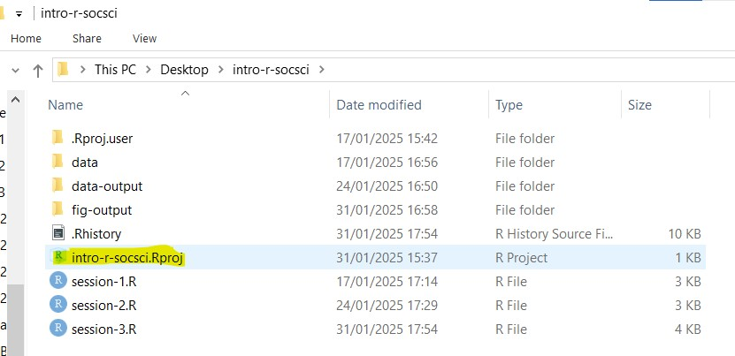
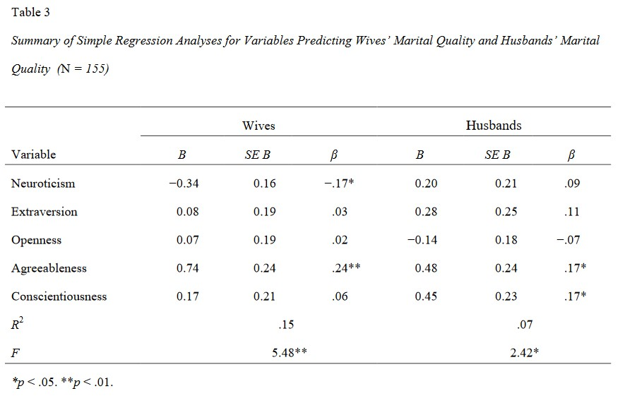
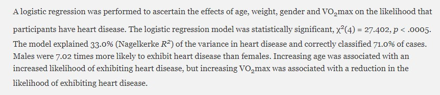
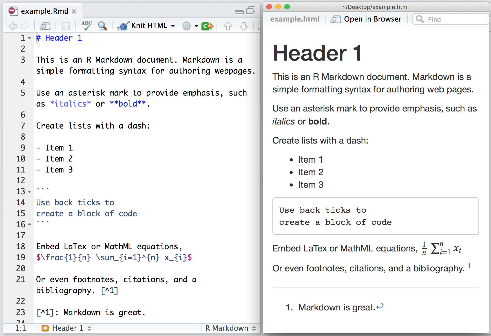
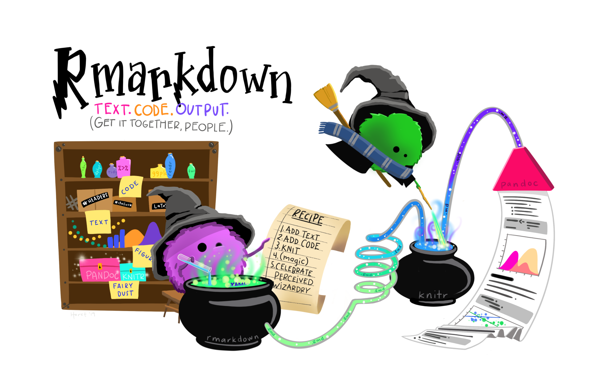

## Garis Besar Hari Ini

1.  Berbagai paket untuk tabel
2.  Regresi Linear Sederhana di R
3.  Regresi Logistik Biner di R

## Buka Proyek Anda - cara yang (mungkin) lebih mudah

1.  Pergi ke folder tempat Anda menyimpan proyek untuk workshop ini

2.  Temukan file dengan ekstensi `.Rproj` - ini adalah file proyek R yang menyimpan semua informasi tentang proyek Anda.



3.  Klik dua kali pada file tersebut. Rstudio akan terbuka dengan proyek Anda dimuat! Ini seharusnya lebih mudah untuk memastikan bahwa Anda memuat proyek yang benar saat membuka Rstudio.

## Instal dan Muat Paket Tambahan yang Kita Butuhkan Hari Ini

1. Ketik baris berikut di konsol R Anda (bagian kiri bawah). Ketik satu per satu.
    -   `install.packages("apaTables")`
    -   `install.packages("huxtable")`
    -   `install.packages("gtsummary")`
    -   `install.packages("car")`

2. Buat skrip R baru bernama `session-5.R`

3. Tempelkan baris berikut ke dalam skrip:

```{r}
#| echo: true

# loading the packages
library(apaTables)
library(huxtable)
library(gtsummary)
library(car)
library(tidyverse)

```


## Muat Data untuk Hari Ini!

```{r}
#| echo: true
#| label: load-data
#| message: false
#| output: false

# read the CSV with WVS data
wvs_cleaned <- read_csv("data-output/wvs_cleaned_v1.csv")

# Convert categorical variables to factors
columns_to_convert <- c("country", "religiousity", "sex", "marital_status", "employment", "age_group")

wvs_cleaned <- wvs_cleaned |> 
    mutate(across(all_of(columns_to_convert), as_factor))

# peek at the data, pay attention to the data types!
glimpse(wvs_cleaned)
```

# Gambaran Singkat - Berbagai Paket untuk Tabel

## apaTables

`apaTables` adalah paket yang akan menghasilkan tabel laporan berformat APA untuk korelasi, ANOVA, dan regresi. Paket ini memiliki kustomisasi terbatas dan sedikit variasi tabel. Dokumentasi online adalah untuk versi "development" yang bukan versi yang akan kita dapatkan jika menginstal secara normal dengan `install.packages()`, jadi kita perlu lebih mengandalkan vignette. [**Lihat dokumentasinya di sini**](https://dstanley4.github.io/apaTables/index.html)


Contoh: dapatkan tabel korelasi untuk `political_scale`, `life_satisfaction`, dan `financial_satisfaction`

```r
library(apaTables)

wvs_cleaned |> 
    select(life_satisfaction, financial_satisfaction, political_scale) |> 
    apa.cor.table( table.number = 1, filename = "fig-output/table-cor.doc")
```

Kode ini akan membuat dokumen word dengan tabel yang sudah diformat dalam gaya APA di dalamnya.

## gtsummary

Paket populer lainnya adalah `gt` (singkatan dari "great tables") dan 'add-on'-nya, `gtsummary`. Paket ini memiliki banyak kustomisasi (yang bisa membingungkan!) tetapi untungnya dokumentasinya cukup bagus dan ada banyak contoh kode. [**Lihat dokumentasinya di sini**](https://www.danieldsjoberg.com/gtsummary/index.html)

Contoh: dapatkan tabel perbedaan rata-rata untuk `political_scale`, `life_satisfaction`, dan `financial_satisfaction`, dikelompokkan berdasarkan `sex`

```{r}
#| echo: true
#| output-location: slide

library(gtsummary)

wvs_cleaned |> 
    dplyr::select(life_satisfaction, financial_satisfaction, political_scale, sex) |> 
    tbl_summary(by = sex) |> 
    add_difference()
```

## Cara Menyimpan Tabel gtsummary()

1.  Tabel akan ditampilkan di bawah tab "Viewer" di sisi kanan bawah Rstudio.
2.  Pilih seluruh tabel, lalu salin dengan Ctrl + C (atau Cmd + C di Macbook)
3.  Tempelkan tabel dengan Ctrl + V (atau Cmd + V di Macbook) ke dokumen word atau Google doc Anda.

# Regresi Linear Sederhana 

## Regresi Linear Sederhana: Apa itu?

**Regresi linear** adalah metode statistik yang digunakan untuk memodelkan hubungan antara variabel dependen (hasil) dan satu atau lebih variabel independen (prediktor) dengan menyesuaikan persamaan linear pada data yang diamati. Rumus matematikanya terlihat seperti ini:

::: columns
::: {.column width="30%"}
$$
Y = \beta_0 + \beta_1X + \varepsilon
$$
:::

::: {.column style="font-size: 75%; width: 70%;"}
-   $Y$ - variabel dependen; **harus kontinu**
-   $X$ - variabel independen (jika lebih dari satu, akan ada $X_1$ , $X_2$ , dan seterusnya. Ini bisa ordinal, nominal, atau kontinu
-   $\beta_0$ - y-intercept. Merepresentasikan nilai yang diharapkan dari variabel dependen $Y$ ketika variabel independen $X$ diatur ke nol.
-   $\beta_1$ - slope / koefisien untuk variabel independen
-   $\varepsilon$ - error term. (Dalam beberapa contoh Anda mungkin melihat ini dihilangkan dari rumus).
:::
:::

Contoh:

-   Apakah **usia** seseorang memengaruhi **kepuasan hidup** mereka?
-   Apakah **usia** dan **negara** seseorang memengaruhi **kepuasan hidup** mereka?

## Regresi Linear: Satu Prediktor Kontinu

**Pertanyaan Penelitian:** Apakah **usia** seseorang memengaruhi **kepuasan hidup** mereka?

- Hasil/VD ($Y$): `life_satisfaction`
- Prediktor/VI ($X$): `age`

```{r}
#| echo: true
#| output-location: fragment
life_model1 <- lm(life_satisfaction ~ age, data = wvs_cleaned)
summary(life_model1) #summarize the result
```

--- 

::: {style="font-size: 80%"}

-   **Call**: rumus yang digunakan

-   **Residuals**: gambaran umum distribusi residual (nilai yang diharapkan dikurangi nilai yang diamati) -- kita dapat memplot ini untuk memeriksa homoskedastisitas

-   **Coefficients**: menunjukkan intercept, koefisien regresi untuk variabel prediktor, dan signifikansi statistiknya

-   **Residual standard error**: perbedaan rata-rata antara hasil yang diamati dan yang diharapkan oleh model. Umumnya semakin rendah, semakin baik.

-   **R-squared & Adjusted R-squared**: menunjukkan proporsi variasi dalam hasil yang dapat dijelaskan oleh model (yaitu goodness of fit).

-   **F-statistics**: menunjukkan apakah model secara keseluruhan signifikan secara statistik dan apakah model menjelaskan lebih banyak varians daripada model dasar (hanya intercept).
:::

## Menarasikan Hasil

Berikut adalah salah satu cara yang mungkin untuk menarasikan hasil Anda:

> Analisis regresi linear dilakukan untuk menilai pengaruh usia terhadap kepuasan hidup di Kanada, Singapura, dan Selandia Baru. Usia adalah prediktor yang signifikan secara statistik tetapi lemah (B = 0.016, SE = 0.001, p < 0.001), yang menunjukkan bahwa untuk setiap tambahan satu tahun usia, kepuasan hidup meningkat sebesar 0.016 unit. 

> Model ini signifikan secara statistik (F(1, 6401) = 147.7, p < 0.001) dan menjelaskan sekitar 2% varians dalam kepuasan hidup (R² = 0.022, Adjusted R² = 0.0224). 

## Sajikan Hasil Regresi Anda - huxtable

```{r}
#| echo: true

huxreg("life satisfaction" = life_model1)

```

## Regresi Linear: Beberapa Prediktor Kontinu

**Pertanyaan Penelitian:** Apakah usia dan kepuasan finansial seseorang memengaruhi kepuasan hidup mereka?

- Hasil/VD ($Y$): `life_satisfaction`
- Prediktor/VI ($X$): `financial_satisfaction` dan `age`

```{r}
#| echo: true
#| output-location: slide

life_model2 <- lm(life_satisfaction ~ financial_satisfaction + age, 
                  data = wvs_cleaned)
summary(life_model2)
```
## Cara yang Mungkin untuk Menjelaskan Hasil

> Analisis regresi berganda dilakukan untuk menguji bagaimana kepuasan finansial dan usia memprediksi kepuasan hidup. Kepuasan finansial adalah prediktor yang kuat (B = 0.529, SE = 0.008, p < 0.001), yang menunjukkan bahwa untuk setiap peningkatan satu unit dalam kepuasan finansial, kepuasan hidup meningkat sebesar 0.529 unit. Usia juga merupakan prediktor yang signifikan tetapi lebih lemah (B = 0.006, SE = 0.001, p < 0.001), dengan setiap tambahan satu tahun usia dikaitkan dengan peningkatan 0.006 unit dalam kepuasan hidup.

> Model ini signifikan secara statistik (F(2, 6400) = 2268, p < 0.001) dan menjelaskan 41.5% varians dalam kepuasan hidup (R² = 0.415, Adjusted R² = 0.415). 

## Sajikan Hasil Regresi Anda - tbl_regression() dari gtsummary

```{r}
#| echo: true

life_model2 |> tbl_regression() |> bold_p()
```

::: aside
More on `tbl_regression()` by `gtsummary`: <https://www.danieldsjoberg.com/gtsummary/reference/tbl_regression.html>
:::

## Pelaporan Hasil: Contoh Tabel Regresi

:::: {.columns}

::: {.column width="60%"}

:::

::: {.column width="40%"}
Anda mungkin menemui format tabel yang berbeda saat melaporkan hasil regresi, tetapi ada beberapa elemen kunci yang umumnya harus disertakan. 

Elemen tersebut adalah: jumlah observasi ($N$), koefisien (B = tidak terstandarisasi, koefisien mentah dalam unit pengukuran asli; $\beta$ = terstandarisasi, dikonversi ke unit deviasi standar), standard error (SE), interval kepercayaan (95% CI), dan p-value. Metrik lain yang perlu disertakan adalah statistik $R^2$ dan $F$. 
:::

::::


::: aside

- The above screenshot is taken from <https://www.ncfr.org/system/files/2017-01/regression_0.pdf>
- [APA recommended format](https://apastyle.apa.org/style-grammar-guidelines/tables-figures/sample-tables#regression)

:::

## Menyajikan Model Anda {.scrollable}

Jika Anda mendapatkan error "huxreg not found", Anda mungkin perlu:

1.  Instal library dengan menjalankan baris ini di terminal Anda: `install.packages("huxtable")`

2.  Kemudian muat ke skrip Anda dengan baris ini: `library(huxtable)`

Untuk info lebih lanjut tentang huxreg, kunjungi: <https://cran.r-project.org/web/packages/huxtable/vignettes/huxreg.html>

```{r}
#| echo: true
#| output-location: slide

huxreg("life_satisfaction (model1)" = life_model1, 
       "life_satisfaction (model2)" = life_model2,
       number_format = 4,
       bold_signif = 0.05,
       statistics = c( "R squared" = "r.squared", "N" = "nobs", "F" = "statistic",
      "P value" = "p.value"))
```


## FYI: Multikolinearitas

Perhatian! Saat melakukan uji tipe regresi, waspadai multikolinearitas.

Multikolinearitas adalah situasi di mana dua atau lebih variabel prediktor sangat berkorelasi satu sama lain. Hal ini membuat sulit untuk menentukan kontribusi spesifik dari setiap variabel prediktor terhadap hubungan tersebut.

Salah satu cara untuk memeriksanya:

-   Nilai korelasi antara variabel prediktor dalam model Anda menggunakan Variance Inflation Factor (VIF)

-   Jika tampaknya sangat berkorelasi (\> 5 atau lebih), salah satu cara termudah (dan cukup dapat diterima) adalah dengan menghapus prediktor yang kurang signifikan dari model Anda :D

```{r}
#| echo: true
car::vif(life_model2)
```

## Regresi Linear: Satu Prediktor Kategorikal

**Pertanyaan Penelitian**: Eksplorasi perbedaan kepuasan hidup antar kelompok usia

- Hasil/VD ($Y$): `life_satisfaction`
- Prediktor/VI ($X$): `age_group`

::: callout-note
Sebelum melanjutkan analisis, pastikan semua variabel kategorikal yang terlibat sudah diubah menjadi faktor!
:::

```{r}
#| echo: true

str(wvs_cleaned$life_satisfaction)
str(wvs_cleaned$age_group)
```

## Melanjutkan Analisis

Ringkasan analisis seharusnya terlihat seperti ini:

```{r}
#| echo: true
life_model3 <- lm(life_satisfaction ~ age_group, data = wvs_cleaned)
summary(life_model3)
```

-   Saat menginterpretasikan prediktor kategorikal dalam regresi, satu kategori diperlakukan sebagai kategori referensi, yang berfungsi sebagai dasar perbandingan. Dalam kasus ini, kategori referensi sesuai dengan intercept.

-   Secara default, kategori pertama dalam data digunakan sebagai kategori referensi, kecuali ditentukan lain.

## Menarasikan Hasil

Berikut adalah salah satu cara yang mungkin untuk menarasikan hasil Anda:

> Analisis regresi linear dilakukan untuk menguji bagaimana kelompok usia memprediksi kepuasan hidup. Dengan kelompok usia termuda (15-28) sebagai kelompok referensi (intercept = 6.66, SE = 0.06), semua kelompok usia lainnya menunjukkan kepuasan hidup yang secara signifikan lebih tinggi. Kelompok usia 29-44 mendapat skor 0.37 unit lebih tinggi (SE = 0.07, p < 0.001), kelompok usia 45-60 mendapat skor 0.35 unit lebih tinggi (SE = 0.07, p < 0.001), dan kelompok usia 61+ menunjukkan perbedaan terbesar, mendapat skor 0.87 unit lebih tinggi (SE = 0.07, p < 0.001) dibandingkan kelompok referensi.

> Model ini signifikan secara statistik (F(3, 6399) = 55.44, p < 0.001) tetapi hanya menjelaskan 2.5% varians dalam kepuasan hidup (R² = 0.025, Adjusted R² = 0.025).

## Menyajikan Tabel Regresi {.scrollable}

```{r}
#| echo: true
#| output-location: slide

huxreg("life satisfaction (model3)" = life_model3,
       number_format = 4,
       bold_signif = 0.05,
       statistics = c( "R squared" = "r.squared", "N" = "nobs", "F" = "statistic",
      "P value" = "p.value"))
```

## Prediktor Kategorikal: Mengubah Referensi

Mari ubah kategori referensi untuk variabel `age_group` menjadi "61+".

```{r}
#| echo: true

wvs_cleaned <- wvs_cleaned |> 
    mutate(age_group = relevel(age_group, ref = "61+"))

str(wvs_cleaned$age_group)
```

Jalankan ulang analisis dengan kategori referensi baru

```{r}
#| echo: true
#| output-location: slide
life_model3a<- lm(life_satisfaction ~ age_group, data = wvs_cleaned)
summary(life_model3a)
```


## Mengubah Kategori Dasar untuk Faktor Terurut

Misalkan kita memiliki kolom dengan faktor terurut dalam data kita bernama `education` dengan level `Primary`, `Secondary`, dan `Tertiary`. Berikut cara mengubah urutannya, jika kita ingin menempatkan `Secondary` sebelum `Primary`.

``` r
wvs_cleaned <- wvs_cleaned |> 
    mutate(education = factor(education, 
                         levels = c("Secondary", "Primary", "Tertiary"), 
                         ordered = TRUE))
```

::: {.callout-note appearance="simple" title="Mengubah Level Faktor Terurut"}
Sebelumnya, kita bisa menggunakan fungsi `relevel()` untuk mengubah kategori referensi untuk faktor terurut. Namun, di versi R terbaru, ini tidak lagi berfungsi untuk faktor terurut, jadi kita sekarang menggunakan metode yang ditunjukkan dalam kode di atas. Fungsi `relevel()` masih berfungsi untuk faktor tidak terurut.
:::

## Mari Coba Latihan Regresi Linear Ini! (5 menit)

Buat model regresi bernama `life_model4` yang memprediksi skor `life_satisfaction` berdasarkan `sex`. Kategori referensi harus 'Male'

```{r}
#| echo: true
#| output: true
#| code-fold: true

life_model4 <- lm(life_satisfaction ~ sex, data = wvs_cleaned)
summary(life_model4)
```

# Regresi Logistik Biner

## Regresi Logistik Biner - Apa itu?

Disebut juga sebagai regresi logistik, metode ini digunakan untuk memodelkan hubungan antara sekumpulan variabel independen dan hasil biner.

Variabel independen ini dapat berupa kategorikal atau kontinu.

Rumus Regresi Logistik Biner:

$$
logit(P) = \beta_0 + \beta_1X_1 + \beta_2X_2 + … + \beta_nX_n
$$

Rumus ini juga dapat ditulis seperti di bawah, di mana bagian $logit(P)$ diperluas:

$$
P = \frac{1}{1 + e^{-(\beta_0 + \beta_1X)}}
$$

## Contoh Regresi Logistik Biner

-   Apakah **usia** dan **tingkat pendidikan** seseorang memengaruhi apakah mereka akan memilih Demokrat atau Republik dalam pemilu AS?
-   Apakah jumlah **jam belajar** memengaruhi kemungkinan seorang mahasiswa lulus suatu mata kuliah? (hasil lulus/gagal)

Pada dasarnya, tujuan regresi logistik biner adalah untuk memperkirakan probabilitas suatu peristiwa tertentu terjadi ketika hanya ada dua kemungkinan hasil (oleh karena itu disebut "biner").

## Regresi Logistik Biner: Satu Prediktor Kontinu

**Pertanyaan Penelitian**: Apakah **orientasi politik** peserta memengaruhi kemungkinan puas dengan kehidupan?

-   Hasil/VD ($Y$): `satisfied` 

    -   Hasil kita adalah variabel kontinu, tetapi untuk keperluan praktik workshop ini, mari kita definisikan hasilnya sebagai "Satisfied" jika skor life_satisfaction lebih dari 7 (inklusif), dan "not Satisfied" jika skornya kurang dari 7. 
-   Prediktor/VI ($X$): `political_scale`


## Dummy-coding Variabel Dependen

Sebelum kita melanjutkan perhitungan, kita perlu melakukan **dummy code** pada variabel dependen menjadi 1 dan 0, dengan 1 = Satisfied dan 0 = Not Satisfied. [Info lebih lanjut tentang dummy coding di sini](https://stats.oarc.ucla.edu/other/mult-pkg/faq/general/faqwhat-is-dummy-coding/)

```{r}
#| echo: true
# First, we need to create a binary outcome
wvs_cleaned <- wvs_cleaned |>
    mutate(satisfied = if_else(life_satisfaction >= 7, 1, 0))
# the if_else is from dplyr package (from session 2)

```

```{r}
wvs_cleaned |> select(life_satisfaction, satisfied) |> print(n = 5)
```

## Lakukan Analisis

Mari kita lakukan analisisnya!

```{r}
#| echo: true

life_model5 <- glm(satisfied ~ political_scale,
                family = binomial, 
                data = wvs_cleaned)

summary(life_model5)
```

## Eksponensiasi Koefisien

Jika Anda mengingat rumusnya, hasilnya dinyatakan dalam Probabilitas Logit. Karena kita biasanya melaporkan hasil dalam bentuk Odds Ratio (OR), lakukan eksponensiasi pada koefisien.

```{r}
#| echo: true

exp(coef(life_model5))

```
Kita juga dapat menggunakan `tbl_regression()` untuk melakukan ini:

```{r}
#| echo: true
library(gtsummary)
life_model5 |> tbl_regression(exponentiate = TRUE) |> 
    bold_p() 
```


::: aside
More on `tbl_regression()` by `gtsummary`: <https://www.danieldsjoberg.com/gtsummary/reference/tbl_regression.html>
:::

## Mendapatkan χ² (chi-squared) untuk Melaporkan Signifikansi Model

Uji kecocokan χ² (Chi-squared) menguji apakah model Anda cocok dengan data secara signifikan lebih baik daripada model null (model tanpa prediktor). Seperti yang Anda lihat, ini tidak ada dalam hasil `glm()`, tetapi kita dapat menghitungnya secara manual menggunakan Null dan Residual deviance serta df seperti ini:

*   Null deviance: 7731
*   Residual deviance: 7690
*   Selisih: 7731 - 7690 = 41 (ini adalah nilai χ²)

Untuk mendapatkan p-value, kita memerlukan derajat kebebasan dan χ²:

*   df = selisih derajat kebebasan (6402 - 6401 = 1)
*   χ² = 41

```{r}
#| echo: true

pchisq(41, df=1, lower.tail=FALSE)  # will give p-value
```


## Mendapatkan χ² (chi-squared) dan Pseudo R-squared (untuk Keperluan Pelaporan)

Dalam laporan, χ² (chi-squared) model dan R-squared (menunjukkan proporsi varians yang dapat dijelaskan oleh model) harus disertakan. Namun, karena hasil analisis tidak memiliki informasi ini, kita akan menggunakan fungsi `PseudoR2()` dari `DescTools`!

```{r}
#| echo: true
#| output-location: column

# by default, McFadden will be used
DescTools::PseudoR2(life_model5) 
```

Kita dapat mengambil nilai R-squared dan χ² (juga dikenal sebagai nilai G2, yang merupakan singkatan dari Goodness-of-fit) secara bersamaan seperti ini:

```{r}
#| echo: true
#| output-location: column

DescTools::PseudoR2(life_model5, 
                    which = c("G2", "Nagelkerke"))
```


## Jika Anda Perlu Mendapatkan Metode R-squared Lainnya

```{r}
#| echo: true

DescTools::PseudoR2(life_model5, 
                    which = "all")
```

## Interpretasi yang Mungkin dari Hasil

**Interpretasi yang mungkin:**

*(Intercept biasanya tidak diinterpretasikan sebagai odds ratio, jadi kita abaikan untuk saat ini)* 

> Regresi logistik dilakukan untuk memastikan efek orientasi skala politik terhadap kemungkinan individu puas dengan kehidupan versus tidak puas. Model regresi logistik signifikan secara statistik, χ² (1, N = 6403) = 41.02, p < .001. 

> Model ini menjelaskan 0.9% (Nagelkerke R²) varians dalam kepuasan hidup. Orientasi skala politik dikaitkan dengan peningkatan kemungkinan puas dengan kehidupan (OR = 1.09, 95% CI [1.06, 1.12], p < .001), yang menunjukkan bahwa untuk setiap peningkatan satu unit dalam orientasi skala politik (1-10), odds puas dengan kehidupan meningkat sebesar 9%.

::: aside
More on interpreting Odds Ratio: <https://stats.oarc.ucla.edu/other/mult-pkg/faq/general/faq-how-do-i-interpret-odds-ratios-in-logistic-regression/>
:::


## Rekap - mengapa saya perlu melaporkan ini?

* Uji kecocokan χ² (Chi-squared) menguji apakah model Anda cocok dengan data secara signifikan lebih baik daripada model null (model tanpa prediktor). 

* R-squared "standar" biasanya tidak dilaporkan untuk regresi logistik karena tidak seberguna dalam regresi linear. Tetapi kita tetap ingin melihat seberapa banyak varians dalam data yang dapat dijelaskan oleh model. 

* Pseudo R-squared mencoba meniru R-squared tradisional dengan menunjukkan seberapa banyak variasi dalam hasil yang dijelaskan oleh model Anda, tetapi disesuaikan untuk bekerja dengan hasil biner. Ini semacam menjawab pertanyaan "Seberapa baik model saya menjelaskan data?"

* Dimungkinkan untuk memiliki χ² yang signifikan (berarti model Anda signifikan secara statistik dan lebih baik daripada tidak ada model) tetapi Pseudo R-squared yang rendah (menunjukkan masih belum banyak menjelaskan variasi). Ini tidak kontradiktif - ini hanya berarti model Anda lebih baik daripada tebakan acak tetapi masih ada banyak variasi yang belum dijelaskan. (Cukup umum dalam ilmu sosial; bagaimanapun, perilaku manusia itu kompleks!)


## FYI - Contoh Nyata Pelaporan Regresi Logistik

Di bawah ini adalah contoh bagaimana Anda mungkin ingin menarasikan hasil Anda. Perhatikan nilai-nilai yang disebutkan dalam paragraf di bawah.



Singkatnya, Anda kemungkinan besar harus menyebutkan p-value, koefisien (untuk regresi linear), Odds Ratio (untuk regresi logistik) dengan interval kepercayaan, chi-squared (χ²), dan R-squared. Anda juga harus menyertakan informasi ini dalam tabel regresi Anda. 

::: aside
The screenshot is retrieved from <https://statistics.laerd.com/spss-tutorials/binomial-logistic-regression-using-spss-statistics.php>

:::


## Tabel Regresi

Meskipun menggunakan huxtable, Anda mungkin perlu mengedit tabel lebih lanjut untuk menyertakan statistik yang hilang 

```{r}
#| echo: true

huxreg("life_satisfaction" = life_model5, statistics = c("R2" = "r.squared", "logLik", "AIC"))
```

## Regresi Logistik Biner: Satu Prediktor Kategorikal

**Pertanyaan Penelitian**: Apakah **religiusitas** memengaruhi kemungkinan puas dengan kehidupan?

-   Hasil/VD ($Y$): `satisfied` 
-   Prediktor/VI ($X$): `religiousity` - mari kita tetapkan "A religious person" sebagai kategori referensi!

```{r}
#| echo: true
#| output-location: slide

wvs_cleaned <- wvs_cleaned |> 
    mutate(religiousity = relevel(religiousity, ref = "A religious person"))

life_model6 <- glm(satisfied ~ religiousity,
                      family = "binomial",
                      data = wvs_cleaned)

summary(life_model6)
exp(coef(life_model6))
```

## Eksponensiasi Koefisien

Jika Anda mengingat rumusnya, hasilnya dinyatakan dalam Probabilitas Logit. Karena kita biasanya melaporkan hasil dalam bentuk Odds Ratio (OR), lakukan eksponensiasi pada koefisien.

```{r}
#| echo: true

library(gtsummary)
life_model6 |> tbl_regression(exponentiate = TRUE) |>  
    bold_p()
```


## Mendapatkan R-squared

Mari kita ambil nilai R-squared dan Chi-square χ² (juga dikenal sebagai nilai G2, yang merupakan singkatan dari Goodness-of-fit)


```{r}
#| echo: true
DescTools::PseudoR2(life_model6, 
                    which = c("G2", "Nagelkerke"))
```

```{r}
#| echo: true
# get the other R-squared if you like
DescTools::PseudoR2(life_model6, 
                    which = "all")
```

## Menarasikan Hasil

**Interpretasi yang mungkin:**

*(Intercept biasanya tidak diinterpretasikan sebagai odds ratio, jadi kita abaikan untuk saat ini)* 

> Regresi logistik dilakukan untuk memastikan efek religiusitas terhadap kemungkinan individu puas dengan kehidupan versus tidak puas. Model regresi logistik signifikan secara statistik, χ² (3, N = 6403) = 15.65, p < .001. 

> Model ini menjelaskan 0.3% (Nagelkerke R²) varians dalam kepuasan hidup. Dibandingkan dengan orang religius (kelompok referensi), tidak religius dikaitkan dengan odds kepuasan hidup yang lebih rendah (OR = 0.84, 95% CI [0.74, 0.95], p = .004), dan menjadi ateis juga dikaitkan dengan odds kepuasan hidup yang lebih rendah (OR = 0.76, 95% CI [0.65, 0.89], p < .001). Tidak ada perbedaan signifikan dalam kepuasan hidup bagi mereka yang tidak yakin tentang keyakinan agama mereka dibandingkan dengan orang religius (OR = 1.24, 95% CI [0.61, 2.52], p = .550).

::: aside
More on logistic regression: <https://stats.oarc.ucla.edu/r/dae/logit-regression/>
:::

## Sajikan Kedua Model dalam Tabel {.scrollable}

Perhatikan bahwa R-squared tidak ada di sini, jadi pastikan untuk menambahkannya saat Anda menempelkan tabel ini ke dokumen Anda. 

```{r}
#| echo: true
library(huxtable)
huxreg(life_model5, life_model6)
```


## Mari Coba Latihan Regresi Logistik Ini! (5 menit)

Buat model regresi bernama `life_model7` yang memprediksi kemungkinan puas dengan kehidupan berdasarkan `sex`. 

```{r}
#| echo: true
#| output: false
#| code-fold: true

life_model7 <- glm(satisfied ~ sex,
                  family = "binomial", 
                  data = wvs_cleaned) 

summary(life_model7)
exp(coefficients(life_model7))
```

# Apa itu Quarto? Apa itu Markdown?

## **Markdown (Khususnya, R Markdown)** {.incremental}

-   **Markdown** adalah bahasa markup ringan yang menyediakan cara sederhana dan mudah dibaca untuk menulis teks berformat tanpa menggunakan HTML atau LaTeX yang kompleks. Markdown dirancang agar pembuatan konten mudah bagi semua orang!

    -   File Markdown dapat dikonversi menjadi HTML atau format lainnya.
    -   File Markdown generik memiliki ekstensi `.md`.

-   **R Markdown** adalah ekstensi dari Markdown yang menggabungkan potongan kode R dan memungkinkan Anda membuat dokumen dinamis yang mengintegrasikan teks, kode, dan output (seperti tabel dan plot).

    -   File RMarkdown memiliki ekstensi `.Rmd`.

## RMarkdown dalam Aksi

{fig-align="center"}

## Cara Kerjanya

{fig-align="center"}

## Quarto

-   **Quarto** adalah versi [multi-bahasa]{.underline}, [generasi berikutnya]{.underline} dari R Markdown oleh Posit dan mencakup puluhan fitur dan kemampuan baru sekaligus dapat merender sebagian besar file Rmd yang ada tanpa modifikasi.

{fig-align="center"}

## Quarto dalam Aksi: Skrip R + Markdown

{fig-align="center"}

## Skrip R vs Quarto

::: columns
::: {.column width="50%"}
**Skrip R**

-   Bagus untuk debugging cepat, eksperimen

-   Format yang lebih disukai jika Anda mengarsipkan kode ke GitHub atau repositori data

-   Lebih cocok untuk tugas "produksi" misalnya mengotomatiskan pembersihan dan pemrosesan data, fungsi kustom, dll.
:::

::: {.column width="50%"}
**Quarto**

-   Bagus untuk laporan dan presentasi untuk menampilkan wawasan/proses penelitian Anda karena mengintegrasikan kode, teks naratif, visualisasi, dan hasil.

-   Sangat berguna ketika Anda membutuhkan laporan dalam berbagai format, misalnya dalam Word dan PPT.

-   Fakta menarik: website kursus dan slide ini semuanya dibuat menggunakan Quarto
:::
:::

## Jika Anda tertarik untuk mempelajari lebih lanjut...

Quarto memiliki dokumentasi yang sangat lengkap dan komunitas yang aktif. Anda dapat mempelajari lebih lanjut melalui sumber daya berikut:

-   [Dokumentasi resmi Quarto](https://quarto.org/)
-   [Tutorial membuat dokumen reprodusibel dengan Quarto di RStudio](https://quarto.org/docs/get-started/)
-   [Membuat slide presentasi dengan Quarto dan Revealjs](https://quarto.org/docs/presentations/revealjs/)
-   [Membangun website dan blog dengan Quarto](https://quarto.org/docs/websites/)

# Praktik Terbaik + Sumber Daya Lainnya

## Praktik Terbaik R

-   Gunakan `<-` untuk menetapkan nilai ke objek.

    -   Hanya gunakan `=` saat meneruskan nilai ke parameter fungsi.

-   [**Jangan mengubah data mentah Anda**]{.underline}; simpan data yang sudah diolah/dibersihkan ke file baru dan pisahkan dari data mentah.

-   Manfaatkan R projects untuk mengorganisir data Anda dan memudahkan pengiriman ke kolaborator.

    -   Meskipun demikian, untuk proyek pengkodean, cara terbaik untuk berkolaborasi adalah menggunakan GitHub atau platform serupa.

-   Kapan pun memungkinkan dan masuk akal untuk proyek Anda, ikuti konvensi umum saat memberi nama objek, skrip, dan fungsi. Salah satu panduan yang bisa Anda ikuti adalah [panduan gaya tidyverse dari Hadley Wickham](https://style.tidyverse.org/).

## Referensi Pedoman APA untuk Pelaporan Statistik

Periksa dengan dosen Anda seberapa ketat Anda harus mengikuti pedoman, atau apakah ada format tertentu yang diperlukan.

-   [APA Style 7th Edition Numbers and Statistics Guide](https://apastyle.apa.org/instructional-aids/numbers-statistics-guide.pdf)
-   [University of Washington - Reporting Results of Common Statistical Tests in APA Format](https://psych.uw.edu/storage/writing_center/stats.pdf)
-   [Illinois State University - A Short Guide to Handling Numbers and Statistics in APA Format (in 6th Edition)](https://about.illinoisstate.edu/mshesso-test2/reporting-statistics-in-apa-style/)
-   [Statistic Tables in APA recommended format](https://apastyle.apa.org/style-grammar-guidelines/tables-figures/sample-tables#regression)

# Terima Kasih atas Partisipasi Anda 😄

:::: {.columns}

::: {.column width="35%"}

:::

::: {.column width="65%"}
Semoga sukses untuk studi dan perjalanan akademis Anda! *(mendoakan nilai terbaik + kesuksesan untuk semua peserta workshop)*

Jika Anda membutuhkan bantuan dengan R atau Quarto, silakan hubungi panitia ISEI Workshop.
:::

::::


## Survei Pasca-Workshop

Silakan pindai kode QR ini atau klik tautan di bawah untuk mengisi survei pasca-workshop. Seharusnya tidak memakan waktu lebih dari 2-3 menit.

Tautan survei: <https://smusg.asia.qualtrics.com/jfe/form/SV_862Si6NAqkbWbPM>

{width="500"}
