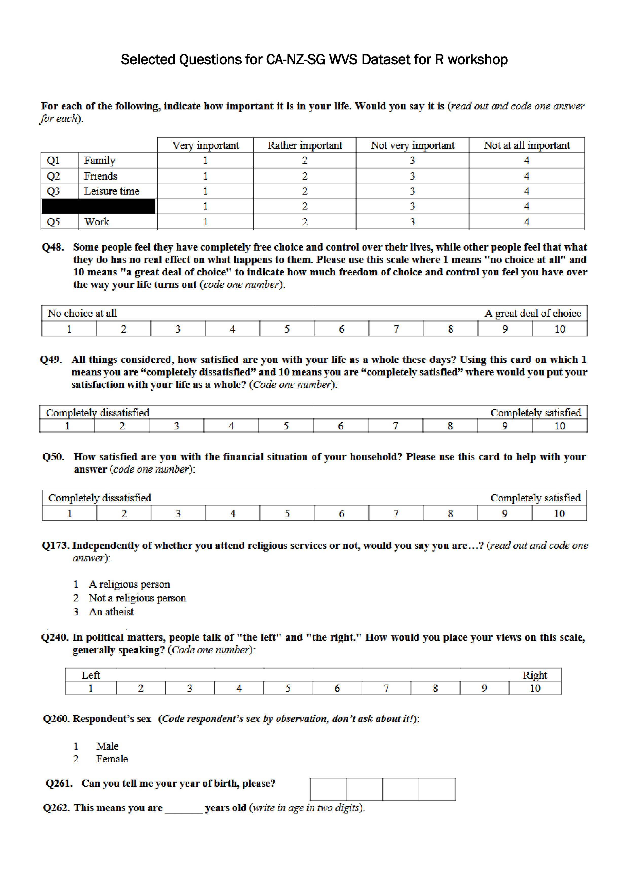
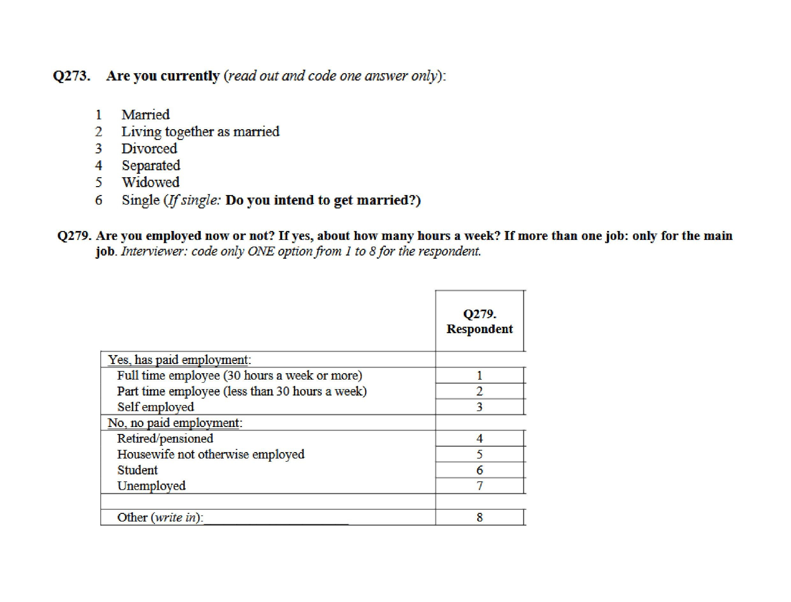

Untuk workshop ini, kita akan menggunakan dataset yang disimpan dalam file CSV bernama `wvs-wave7-sg-ca-nz.csv`.

```{=html}
<a href="https://raw.githubusercontent.com/bellaratmelia/introductory-r-socsci/refs/heads/main/data/wvs-wave7-sg-ca-nz.csv" type="button" class="btn btn-success">Klik di sini untuk membuka wvs-wave7-sg-ca-nz.csv, lalu tekan Ctrl + S / Cmd + S untuk menyimpannya ke folder data Anda</a>
```


### Data untuk sesi 3 dan seterusnya

Jika Anda melewatkan Sesi 2 di mana kita membersihkan dan merapikan data, Anda dapat mengunduh data yang sudah dibersihkan di sini: [wvs_cleaned_v1.csv](https://raw.githubusercontent.com/bellaratmelia/introductory-r-socsci/refs/heads/main/data-output/wvs_cleaned_v1.csv)


::: {.callout-note appearance="simple"}
### Apa itu CSV?

CSV (Comma-Separated Values) adalah jenis file yang menyimpan data dalam format teks biasa. Setiap baris dalam file mewakili satu baris data, dan di dalam setiap baris, potongan data individual (seperti angka atau kata) dipisahkan oleh koma.

Format ini umumnya digunakan untuk menyimpan dan mentransfer data, terutama dalam spreadsheet dan database. Karena hanya berupa teks biasa, format ini ideal jika Anda memiliki data dalam jumlah besar.

Anda dapat membuka file CSV di Excel, Google Sheets, atau bahkan Notepad!
:::

### Kamus Data (Data Dictionary) untuk Dataset WVS

World Values Survey (<www.worldvaluessurvey.org>) adalah jaringan global ilmuwan sosial yang mempelajari perubahan nilai dan dampaknya terhadap kehidupan sosial dan politik, dipimpin oleh tim peneliti internasional, dengan asosiasi dan sekretariat WVS yang berkantor pusat di Stockholm, Swedia.

Kuesioner sebenarnya terdiri dari lebih dari 200 pertanyaan dengan responden dari berbagai negara. Untuk keperluan workshop ini, kita hanya menggunakan 16 variabel/pertanyaan dengan responden dari Kanada, Selandia Baru, dan Singapura. Ke-16 variabel tersebut adalah:

`country`

:   Character variable containing three-letter country codes: `CAN`,
    `NZL`, and `SGP`

`ID`

:   Numeric identifier unique to each survey respondent

`family_importance`

:   Numeric scale from 1 to 4 measuring importance of family, where 1
    indicates highest importance

`friends_importance`

:   Numeric scale from 1 to 4 measuring importance of friends, where 1
    indicates highest importance

`leisure_importance`

:   Numeric scale from 1 to 4 measuring importance of leisure time,
    where 1 indicates highest importance

`work_importance`

:   Numeric scale from 1 to 4 measuring importance of work, where 1
    indicates highest importance

`freedom`

:   Numeric scale from 1-10 measuring perceived freedom of choice and
    control, where 10 indicates most freedom

`life_satisfaction`

:   Numeric scale from 1-10 measuring overall life satisfaction, where
    10 indicates highest satisfaction

`financial_satisfaction`

:   Numeric scale from 1-10 measuring satisfaction with financial
    situation, where 10 indicates highest satisfaction

`religiousity`

:   indicates religious self-identification: `A religious person`,
    `Not a religious person`, `An atheist`

`political_scale`

:   Numeric scale from 1-10 measuring left-right political orientation,
    where 1 is left and 10 is right

`sex`

:   indicates respondent's gender: `male` or `female`

`birthyear`

:   Numeric variable indicating year of birth

`age`

:   Numeric variable indicating respondent's age

`marital_status`

:   indicates current marital status: `Married`,
    `Living together as married`, `Divorced`, `Separated`, `Widowed`,
    `Single`

`employment`

:   indicates current employment status: `Full time`, `Part time`,
    `Self employed`, `Retired/pensioned`,
    `Housewife not otherwise employed`, `Student`, `Unemployed`

Berikut adalah cuplikan pertanyaan-pertanyaan terpilih dan tampilannya dalam kuesioner:





Jika Anda ingin mengetahui lebih lanjut tentang data ini, termasuk codebook dan kuesioner aslinya, kunjungi halaman berikut:
<https://www.worldvaluessurvey.org/WVSDocumentationWV7.jsp>

### Referensi

Haerpfer, C., Inglehart, R., Moreno, A., Welzel, C., Kizilova, K., Diez-Medrano, J., Lagos, M., Norris, P., Ponarin, E. & Puranen B. (2022): World Values Survey Wave 7 (2017-2022) Cross-National Data-Set. Version: 4.0.0. World Values Survey Association. DOI: [doi.org/10.14281/18241.18](https://doi.org/10.14281/18241.18)
