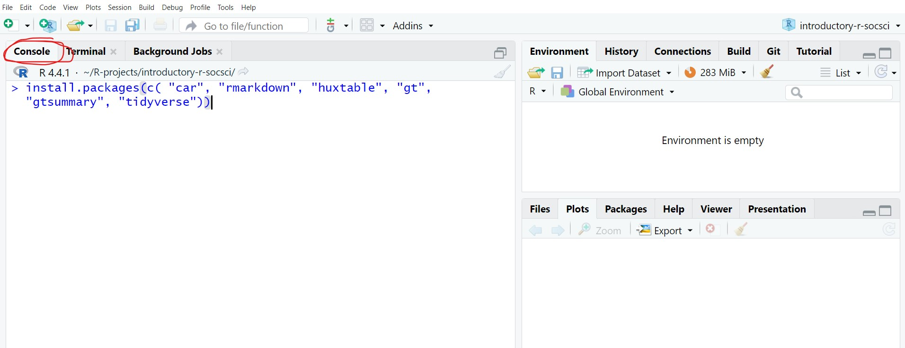

```{=html5}
<style type="text/css">
  .isei-hero {
    --hero-radius: 16px;
    --hero-shadow: 0 20px 50px -15px rgba(20, 60, 140, 0.45);
    --hero-text: #ffffff;
    position: relative;
    width: 100%;
    min-height: clamp(320px, 42vw, 460px);
    border-radius: var(--hero-radius);
    overflow: hidden;
    background:
      radial-gradient(ellipse at 20% 10%, #6ba6ff 0%, transparent 55%),
      radial-gradient(ellipse at 80% 90%, #2a6fd8 0%, transparent 50%),
      linear-gradient(135deg, #4a8eea 0%, #2c6cd5 50%, #1f5cc4 100%);
    color: var(--hero-text);
    font-family: -apple-system, BlinkMacSystemFont, "Segoe UI", "Helvetica Neue",
      Arial, sans-serif;
    box-shadow: var(--hero-shadow);
    isolation: isolate;
  }

  .isei-hero::before {
    content: "";
    position: absolute;
    inset: 0;
    background-image:
      radial-gradient(ellipse 8px 4px at 10% 15%, rgba(255, 255, 255, 0.18), transparent 60%),
      radial-gradient(ellipse 6px 3px at 25% 70%, rgba(255, 255, 255, 0.14), transparent 60%),
      radial-gradient(ellipse 10px 5px at 45% 25%, rgba(255, 255, 255, 0.12), transparent 60%),
      radial-gradient(ellipse 7px 4px at 70% 60%, rgba(255, 255, 255, 0.16), transparent 60%),
      radial-gradient(ellipse 9px 5px at 88% 30%, rgba(255, 255, 255, 0.14), transparent 60%),
      radial-gradient(ellipse 12px 6px at 60% 88%, rgba(255, 255, 255, 0.18), transparent 60%),
      radial-gradient(ellipse 5px 3px at 35% 50%, rgba(255, 255, 255, 0.12), transparent 60%),
      radial-gradient(ellipse 8px 4px at 92% 75%, rgba(255, 255, 255, 0.15), transparent 60%),
      radial-gradient(ellipse 6px 3px at 15% 85%, rgba(255, 255, 255, 0.13), transparent 60%),
      radial-gradient(ellipse 10px 5px at 50% 10%, rgba(255, 255, 255, 0.14), transparent 60%);
    pointer-events: none;
    z-index: 1;
  }

  .isei-hero::after {
    content: "";
    position: absolute;
    bottom: -2%;
    left: 0;
    right: 0;
    height: 30%;
    background-image:
      radial-gradient(circle 18px at 8% 70%, rgba(255, 255, 255, 0.22), transparent 65%),
      radial-gradient(circle 14px at 18% 85%, rgba(255, 255, 255, 0.18), transparent 65%),
      radial-gradient(circle 22px at 32% 60%, rgba(255, 255, 255, 0.20), transparent 65%),
      radial-gradient(circle 16px at 50% 80%, rgba(255, 255, 255, 0.18), transparent 65%),
      radial-gradient(circle 20px at 65% 65%, rgba(255, 255, 255, 0.20), transparent 65%),
      radial-gradient(circle 12px at 78% 85%, rgba(255, 255, 255, 0.16), transparent 65%),
      radial-gradient(circle 18px at 90% 70%, rgba(255, 255, 255, 0.20), transparent 65%);
    pointer-events: none;
    z-index: 1;
  }

  .isei-hero__content {
    position: relative;
    z-index: 2;
    height: 100%;
    padding: clamp(28px, 6%, 56px) clamp(24px, 7%, 72px);
    display: flex;
    flex-direction: column;
    justify-content: center;
    gap: clamp(14px, 2vw, 22px);
    max-width: 720px;
  }

  .isei-hero__eyebrow {
    display: flex;
    align-items: center;
    gap: 16px;
    font-size: clamp(0.85rem, 1.4vw, 1.1rem);
    font-weight: 600;
    letter-spacing: 0.08em;
    text-transform: uppercase;
    margin: 0;
    opacity: 0.95;
  }

  .isei-hero__eyebrow::after {
    content: "";
    flex: 0 0 clamp(60px, 12vw, 140px);
    height: 1px;
    background: rgba(255, 255, 255, 0.55);
  }

  .isei-hero__title {
    font-size: clamp(2rem, 4.2vw, 3.6rem);
    font-weight: 800;
    line-height: 1.05;
    letter-spacing: -0.02em;
    margin: 0;
    max-width: 11ch;
  }

  .isei-hero__subtitle {
    font-size: clamp(0.98rem, 1.45vw, 1.15rem);
    font-weight: 400;
    line-height: 1.6;
    max-width: 40rem;
    opacity: 0.92;
    margin: 0;
  }

  .isei-hero__meta {
    display: flex;
    flex-wrap: wrap;
    gap: 10px;
    margin: 0;
    padding: 0;
    list-style: none;
  }

  .isei-hero__meta-item {
    padding: 8px 14px;
    border: 1px solid rgba(255, 255, 255, 0.22);
    border-radius: 999px;
    background: rgba(255, 255, 255, 0.12);
    backdrop-filter: blur(6px);
    font-size: 0.92rem;
    line-height: 1.2;
  }

  @media (max-width: 640px) {
    .isei-hero {
      min-height: 360px;
    }

    .isei-hero__content {
      padding: 28px 24px;
    }

    .isei-hero__subtitle {
      max-width: 100%;
    }

    .isei-hero__title {
      max-width: 100%;
    }

    .isei-hero__eyebrow::after {
      flex-basis: 72px;
    }
  }
</style>

<div class="isei-hero" role="img" aria-label="Banner ISEI Workshop: Analisis Regresi dan Structural Equation Modelling dengan RStudio">
  <div class="isei-hero__content">
    <p class="isei-hero__eyebrow">ISEI Workshop</p>
    <h1 class="isei-hero__title">Analisis Regresi &amp; SEM</h1>
    <p class="isei-hero__subtitle">
      Pelatihan intensif dengan RStudio untuk peneliti, dosen, dan mahasiswa pascasarjana yang ingin memperkuat analisis data dan publikasi ilmiah.
    </p>
    <ul class="isei-hero__meta" aria-label="Informasi workshop">
      <li class="isei-hero__meta-item">Sabtu, 18 April 2026</li>
      <li class="isei-hero__meta-item">Sekretariat PP ISEI</li>
      <li class="isei-hero__meta-item">Jakarta Selatan</li>
      <li class="isei-hero__meta-item">RStudio</li>
    </ul>
  </div>
</div>
```
<br>

## Selamat Datang!

**Upgrade skill risetmu dan siapkan publikasi ilmiah yang lebih kuat!**

Situs ini merupakan repositori materi pelatihan (slide, kode, dan dataset) untuk **ISEI Workshop: Analisis Regresi dan Structural Equation Modelling (SEM) dengan RStudio** — pelatihan praktis yang dirancang untuk peneliti, dosen, mahasiswa pascasarjana, dan praktisi yang ingin meningkatkan kualitas analisis data untuk publikasi ilmiah.

## Jadwal Workshop

*Klik pada tautan di kolom "Materi" untuk mengakses slide. Materi akan tersedia secara bertahap.*

::: table-schedule
| Sesi | Waktu | Materi | Deskripsi |
|------------------|------------------|------------------|--------------------|
| \~ | Sebelum workshop | Persiapan | Selesaikan [kegiatan pra-workshop](#kegiatan-pra-workshop) |
| 1 | 08.30 – 10.15 | [**Pengantar R, Pengolahan Data, dan Visualisasi**](01-intro.html) | Pengenalan RStudio, tipe data, import data, manipulasi data dengan tidyverse, visualisasi dengan ggplot2, dan statistik deskriptif. |
| \~ | 10.15 – 10.30 | ☕ *Coffee Break* | |
| 2 | 10.30 – 12.00 | [**Analisis Regresi**](02-regresi.html) | Regresi linear sederhana, berganda, dan dengan variabel kategorikal menggunakan data WVS. Diagnostik model dan interpretasi hasil. |
| \~ | 12.00 – 13.00 | 🍽️ *Makan Siang* | |
| 3 | 13.00 – 15.30 | [**Structural Equation Modelling (SEM)**](03-sem.html) | CB-SEM dengan `lavaan` (CFA, full SEM, path diagram) dan PLS-SEM dengan `seminr` (konstruk formatif & reflektif, bootstrap). |
| \~ | Setelah workshop | | [Latihan pasca-workshop](exercises.html) |
:::

```{=html5}
<style type="text/css">
    .table-schedule {width: 100%;}
    .table-schedule th:nth-child(1), .table-schedule td:nth-child(1) { width: 8%; }
    .table-schedule th:nth-child(2), .table-schedule td:nth-child(2) { width: 15%; }
    .table-schedule th:nth-child(3), .table-schedule td:nth-child(3) { width: 30%; }
    .table-schedule th:nth-child(4), .table-schedule td:nth-child(4) { width: 47%; }
</style>
```

## Kegiatan Pra-Workshop {#kegiatan-pra-workshop}

### Tentang R dan RStudio

**R** dan **RStudio** adalah dua alat yang berbeda namun saling melengkapi yang digunakan dalam analisis data dan komputasi statistik.

**R** adalah bahasa pemrograman dan lingkungan perangkat lunak yang dirancang khusus untuk komputasi statistik dan grafis. R adalah alat inti yang memproses data dan melakukan analisis.

**RStudio** adalah Integrated Development Environment (IDE) untuk R. Anggaplah sebagai antarmuka yang ramah pengguna yang memudahkan penulisan kode R, pengelolaan proyek, dan visualisasi output. RStudio tidak wajib untuk menggunakan R, tetapi sangat meningkatkan pengalaman pemrograman R!

::: callout-important
**Selalu** instal R terlebih dahulu sebelum menginstal RStudio, karena RStudio membutuhkan R untuk berfungsi.
:::

### Langkah 1: Instal R

1.  Buka <https://cran.rstudio.com/>

2.  Pilih sistem operasi Anda (Windows, Mac, atau Linux)

3.  Unduh dan instal versi terbaru R

### Langkah 2: Instal RStudio

1.  Kunjungi <https://posit.co/download/rstudio-desktop/>

2.  Gulir ke bawah ke "Download RStudio Desktop"

3.  Klik "Download" dan instal versi terbaru RStudio

### Langkah 3: Instal paket-paket yang dibutuhkan

::: callout-note
**Paket (packages)** di R adalah kumpulan alat, fungsi, dan dataset tambahan yang memperluas kemampuan R. Paket dibuat oleh kontributor di komunitas R.

Analoginya, R seperti smartphone, dan paket seperti aplikasi yang Anda unduh untuk menambah fitur baru. Setiap paket dirancang untuk membantu tugas atau analisis tertentu, seperti membuat grafik, menganalisis jenis data tertentu, atau melakukan uji statistik lanjutan.

Paket menghemat waktu dan memanfaatkan alat buatan ahli tanpa harus menulis kode kompleks dari nol!
:::

1.  Buka RStudio

2.  Salin kode berikut: `install.packages(c("car", "broom", "lavaan", "semPlot", "seminr", "tidyverse", "rmarkdown"))`

3.  Tempel di tab **Console** (lihat gambar di bawah)

4.  Tekan Enter. RStudio akan memproses instalasi paket-paket yang dibutuhkan.




